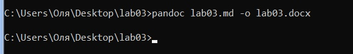
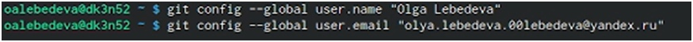
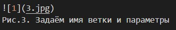
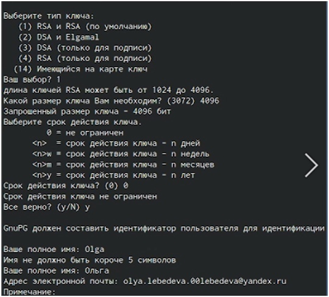

---
## Front matter
title: "Лабораторная работа №3"
subtitle: "Markdown"
author: "Лебедева Ольга Андреевна"

## Generic otions
lang: ru-RU
toc-title: "Содержание"

## Bibliography
bibliography: bib/cite.bib
csl: pandoc/csl/gost-r-7-0-5-2008-numeric.csl

## Pdf output format
toc: true # Table of contents
toc-depth: 2
lof: true # List of figures
lot: true # List of tables
fontsize: 12pt
linestretch: 1.5
papersize: a4
documentclass: scrreprt
## I18n polyglossia
polyglossia-lang:
  name: russian
  options:
	- spelling=modern
	- babelshorthands=true
polyglossia-otherlangs:
  name: english
## I18n babel
babel-lang: russian
babel-otherlangs: english
## Fonts
mainfont: PT Serif
romanfont: PT Serif
sansfont: PT Sans
monofont: PT Mono
mainfontoptions: Ligatures=TeX
romanfontoptions: Ligatures=TeX
sansfontoptions: Ligatures=TeX,Scale=MatchLowercase
monofontoptions: Scale=MatchLowercase,Scale=0.9
## Biblatex
biblatex: true
biblio-style: "gost-numeric"
biblatexoptions:
  - parentracker=true
  - backend=biber
  - hyperref=auto
  - language=auto
  - autolang=other*
  - citestyle=gost-numeric
## Pandoc-crossref LaTeX customization
figureTitle: "Рис."
tableTitle: "Таблица"
listingTitle: "Листинг"
lofTitle: "Список иллюстраций"
lotTitle: "Список таблиц"
lolTitle: "Листинги"
## Misc options
indent: true
header-includes:
  - \usepackage{indentfirst}
  - \usepackage{float} # keep figures where there are in the text
  - \floatplacement{figure}{H} # keep figures where there are in the text
---

# Цель работы
Научиться оформлять отчёты с помощью легковесного языка разметки Markdown.

# Теоретическое введение
1. Чтобы создать заголовок, используйте знак ( # ).

2. Чтобы задать для текста полужирное начертание, заключите его в двойные звездочки.

3. Чтобы задать для текста курсивное начертание, заключите его в одинарные звездочки.

4. Блоки цитирования создаются с помощью символа >.

# Обработка файлов в формате Markdown

Для обработки файлов в формате Markdown будем использовать Pandoc
https://pandoc.org/.

# Ход работы

Используем программу Visual Studio Code. 

Создадим новый файл и выберем в языковом режиме Markdowm.

Копируем шаблон с сайта Гитхаб:(рис. [-@fig:001])

{ #fig:001 width=70% }

Переписываем отчет лабораторной работы №2 полностью в Markdawn.(рис. [-@fig:002])

{ #fig:002 width=70% }

Для фотографий используем следующий синтаксис:(рис. [-@fig:002])

{ #fig:003 width=70% }

В окне предварительного просмотра проверяем, что всё в порядке:(рис. [-@fig:004])

{ #fig:004 width=70% }

# Конвертация файлов 
Открываем консоль Windows и конвертируем необходимый файл в docx и pdf.(рис. [-@fig:005])

{ #fig:005 width=70% }

# Вывод
 Научились оформлять отчёты с помощью легковесного языка разметки Markdown.
