---
## Front matter
title: "Лабораторная работа №5"
subtitle: "Анализ файловой системы Linux. Команды для работы с файлами и каталогами"
author: "Лебедева Ольга Андреевна"

## Generic otions
lang: ru-RU
toc-title: "Содержание"

## Bibliography
bibliography: bib/cite.bib
csl: pandoc/csl/gost-r-7-0-5-2008-numeric.csl

## Pdf output format
toc: true # Table of contents
toc-depth: 2
lof: true # List of figures
lot: true # List of tables
fontsize: 12pt
linestretch: 1.5
papersize: a4
documentclass: scrreprt
## I18n polyglossia
polyglossia-lang:
  name: russian
  options:
	- spelling=modern
	- babelshorthands=true
polyglossia-otherlangs:
  name: english
## I18n babel
babel-lang: russian
babel-otherlangs: english
## Fonts
mainfont: PT Serif
romanfont: PT Serif
sansfont: PT Sans
monofont: PT Mono
mainfontoptions: Ligatures=TeX
romanfontoptions: Ligatures=TeX
sansfontoptions: Ligatures=TeX,Scale=MatchLowercase
monofontoptions: Scale=MatchLowercase,Scale=0.9
## Biblatex
biblatex: true
biblio-style: "gost-numeric"
biblatexoptions:
  - parentracker=true
  - backend=biber
  - hyperref=auto
  - language=auto
  - autolang=other*
  - citestyle=gost-numeric
## Pandoc-crossref LaTeX customization
figureTitle: "Рис."
tableTitle: "Таблица"
listingTitle: "Листинг"
lofTitle: "Список иллюстраций"
lotTitle: "Список таблиц"
lolTitle: "Листинги"
## Misc options
indent: true
header-includes:
  - \usepackage{indentfirst}
  - \usepackage{float} # keep figures where there are in the text
  - \floatplacement{figure}{H} # keep figures where there are in the text
---

# Цель работы 

Ознакомление с файловой системой Linux, её структурой, именами и содержанием каталогов. Приобретение практических навыков по применению команд для работы с файлами и каталогами, по управлению процессами (и работами), по проверке использования диска и обслуживанию файловой системы.

# Теоретическое введение

Для создания текстового файла можно использовать команду touch.

Для просмотра файлов небольшого размера можно использовать команду cat.

Для просмотра файлов постранично удобнее использовать команду less.

Следующие клавиши используются для управления процессом просмотра:

– Space — переход к следующей странице,

– ENTER — сдвиг вперёд на одну строку,

– b — возврат на предыдущую страницу,

– h — обращение за подсказкой,

– q — выход из режима просмотра файла.

# Ход работы

# Задание 1

Выполнили все примеры, приведённые в первой части описания лабораторной работы. (рис. [-@fig:001]) (рис. [-@fig:002])

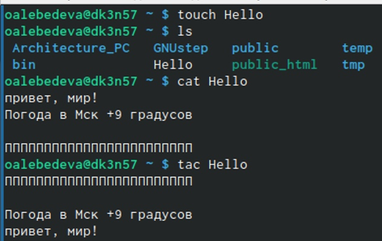{ #fig:001 width=70% }

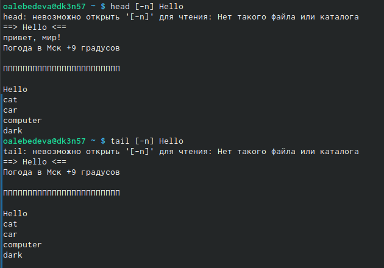{ #fig:002 width=70% }

# Задание 2

Скопировали файл /usr/include/sys/io.h в домашний каталог и назвали его
equipment. (рис. [-@fig:003]) (рис. [-@fig:004]) (рис. [-@fig:005]) (рис. [-@fig:006])

{ #fig:003 width=70% }

{ #fig:004 width=70% }

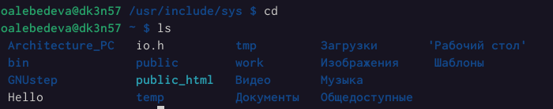{ #fig:005 width=70% }

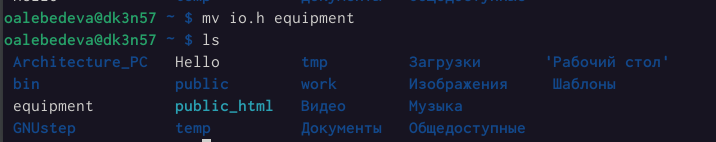{ #fig:006 width=70% }

В домашнем каталоге создали директорию ~/ski.plases. (рис. [-@fig:007])

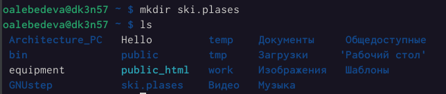{ #fig:007 width=70% }

Переместили файл equipment в каталог ~/ski.plases. (рис. [-@fig:008])

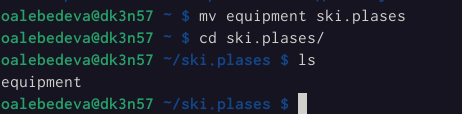{ #fig:008 width=70% }

Переименовали файл /ski.plases/equipment в ~/ski.plases/equiplist. (рис. [-@fig:009]) 

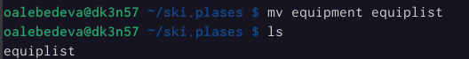{ #fig:009 width=70% }

Создали в домашнем каталоге файл abc1 и скопировали его в каталог ~/ski.plases, назвали его equiplist2. (рис. [-@fig:011])

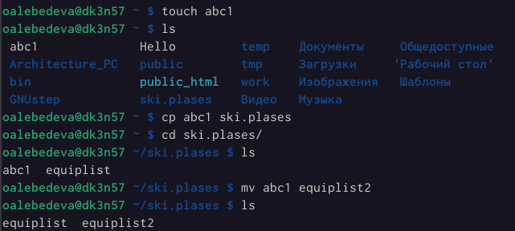{ #fig:011 width=70% }

Создали каталог с именем equipment в каталоге ~/ski.plases. 

Создали каталог с именем equipment в каталоге ~/ski.plases.

Переместили файлы /ski.plases/equiplist и equiplist2 в каталог ~/ski.plases/equipment. (рис. [-@fig:012]) (рис. [-@fig:013])

{ #fig:012 width=70% }

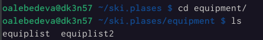{ #fig:013 width=70% }

Создали и переместили каталог /newdir в каталог ~/ski.plases и назвали его plans. (рис. [-@fig:014])

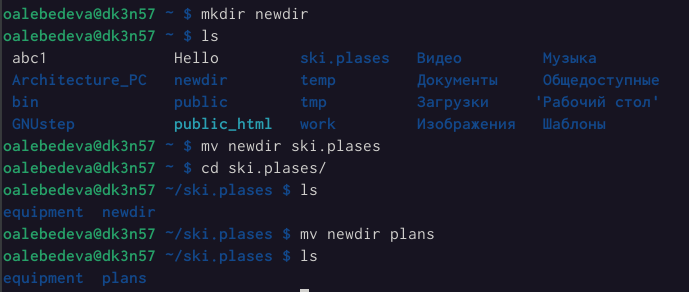{ #fig:014 width=70% }

# Задание 3

Определили опции команды chmod, необходимые для того, чтобы присвоить перечисленным ниже файлам выделенные права доступа, считая, что в начале таких прав нет: (рис. [-@fig:015])

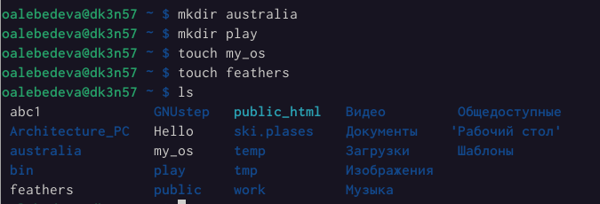{ #fig:015 width=70% }

3.1. drwxr--r-- ... australia (рис. [-@fig:016]) (рис. [-@fig:018]) (рис. [-@fig:019])

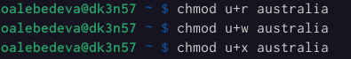{ #fig:016 width=70% }

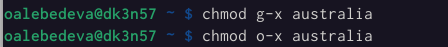{ #fig:018 width=70% }

{ #fig:019 width=70% }

3.2. drwx--x--x ... play (рис. [-@fig:020]) 

{ #fig:020 width=70% }

3.3. -r-xr--r-- ... my_os (рис. [-@fig:021]) (рис. [-@fig:022])

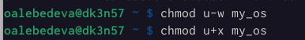{ #fig:022 width=70% }

{ #fig:021 width=70% }

3.4. -rw-rw-r-- ... feathers (рис. [-@fig:023])

{ #fig:023 width=70% }

# Задание 4

Просмотрели содержимое файла /etc/password. (рис. [-@fig:024])

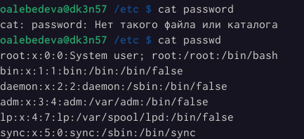{ #fig:024 width=70% }

Скопировали файл /feathers в файл ~/file.old. (рис. [-@fig:025])

{ #fig:025 width=70% }

Переместили файл /file.old в каталог ~/play. (рис. [-@fig:026])

{ #fig:026 width=70% }

Скопировали каталог /play в каталог /fun. Переместили каталог /fun в каталог ~/play и назвали его games.(рис. [-@fig:027])

{ #fig:027 width=70% }

Лишили владельца файла ~/feathers права на чтение. (рис. [-@fig:028])

{ #fig:028 width=70% }

Что произойдёт, если вы попытаетесь просмотреть файл ~/feathers командой cat? (рис. [-@fig:029])

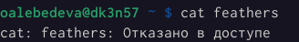{ #fig:029 width=70% }

Что произойдёт, если вы попытаетесь скопировать файл ~/feathers? (рис. [-@fig:030])

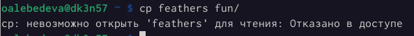{ #fig:030 width=70% }
 
Дали владельцу файла ~/feathers право на чтение. (рис. [-@fig:031])

{ #fig:031 width=70% }

Лишили владельца каталога ~/play права на выполнение. (рис. [-@fig:032])

{ #fig:032 width=70% }

Перейдите в каталог ~/play. Что произошло? (рис. [-@fig:033])

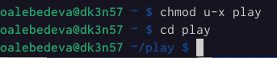{ #fig:033 width=70% }

Дали владельцу каталога ~/play право на выполнение. (рис. [-@fig:034])

{ #fig:034 width=70% }

Прочитали man по командам mount, fsck, mkfs, kill и кратко их охарактеризовали,
приведя примеры. (рис. [-@fig:035]) (рис. [-@fig:036]) (рис. [-@fig:037]) (рис. [-@fig:038]) (рис. [-@fig:039])
 
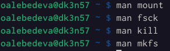{ #fig:039 width=70% }

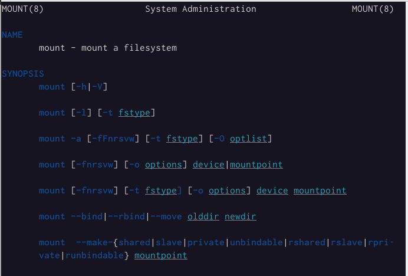{ #fig:035 width=70% }

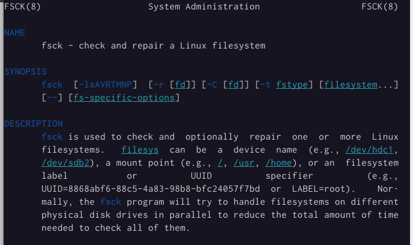{ #fig:036 width=70% }

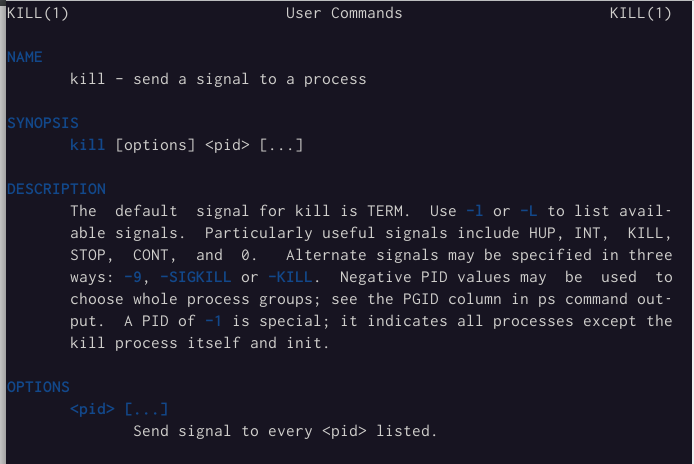{ #fig:037 width=70% }

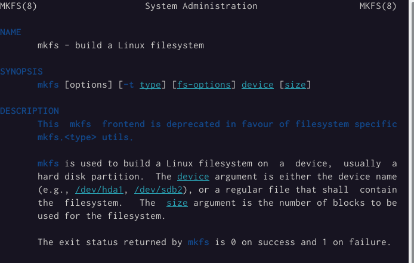{ #fig:038 width=70% }

# Вывод

Ознакомились с файловой системой Linux, её структурой, именами и содержанием каталогов. Приобрели практические навыки по применению команд для работы с файлами и каталогами, по управлению процессами (и работами), по проверке использования диска и обслуживанию файловой системы.

# Контрольные вопросы

1. Дайте характеристику каждой файловой системе, существующей на жёстком диске
компьютера, на котором вы выполняли лабораторную работу.

· Tmpfs — временное файловое хранилище в Unix . Предназначена для монтирования файловой системы, но размещается в ОЗУ вместо физического диска. Подобная конструкция является RAM диском.Все данные в Tmpfs являются временными, в том смысле, что ни одного файла не будет создано на жёстком диске. После перезагрузки все данные, содержащиеся в Tmpfs, будут утеряны.

· Fourth extended file system , сокр. ext4, или ext4fs — журналируемая ФС, используемая в ОС с ядром Linux. Основана на ФС ext3, ранее использовавшейся по умолчанию во многих дистрибутивах GNU/Linux.

· Распределенная сетевая файловая система AFS (Andrew File System) внедрена с целью создания единого файлового пространства пользователей при работе на различных фермах или рабочих станциях ОИЯИ, где домашний каталог пользователя определен как каталог в -AFS.
Использование системы AFS позволяет пользователям осуществлять прямой доступ к файловому пространству других организаций, где эта система используется и где пользователь имеет регистрацию в AFS.

2. Приведите общую структуру файловой системы и дайте характеристику каждой директории первого уровня этой структуры.

Все каталоги можно разделить на две группы: для статической (редко меняющейся) информации – /bin, /usr и динамической (часто меняющейся) информации – /var, /tmp. Исходя из этого администраторы могут разместить каждый из этих каталогов на собственном носителе, обладающем соответствующими характеристиками.

· Корневой каталог. Корневой каталог / является основой любой ФС UNIX. Все остальные каталоги и файлы располагаются в рамках структуры (дерева), порождённой корневым каталогом, независимо от их физического местонахождения.

· /bin. В этом каталоге находятся часто употребляемые команды и утилиты системы общего пользования. Сюда входят все базовые команды, доступные даже если была примонтирована только корневая файловая система. Примерами таких команд являются:Ls,cp и т.д.

· /boot. Директория содержит всё необходимое для процесса загрузки операционной системы: программу-загрузчик, образ ядра операционной системы и т.п..

· /dev. Каталог содержит специальные файлы устройств, являющиеся интерфейсом доступа к периферийным устройствам. Наличие такого каталога не означает, что специальные файлы устройств нельзя создавать в другом месте, просто достаточно удобно иметь один каталог для всех файлов такого типа.

· /etc. В этом каталоге находятся системные конфигурационные файлы. В качестве примеров можно привести файлы /etc/fstab, содержащий список монтируемых файловых систем, и /etc/ resolv.conf, который задаёт правила составления локальных DNS-запросов. Среди наиболее важных файлов – скрипты инифиализации и деинициализации системы. В системах, наследующих особенности UNIX System V, для них отведены каталоги с /etc/rc0.d по /etc/rc6.d и общий для всех файл описания – /etc/inittab.

· /home (необязательно). Директория содержит домашние директории пользователей. Её существование в корневом каталоге не обязательно и её содержимое зависит от особенностей конкретной UNIX-подобной операционной системы.

· /lib. Каталог для статических и динамических библиотек, необходимых для запуска программ, находящихся-в директориях/bin,/sbin.

· /mnt. Стандартный каталог для временного монтирования файловых систем – например, гибких и флэш-дисков, компакт-дисков и т. п.

· /root (необязательно). Директория содержит домашюю директорию суперпользователя. Её существование в корневом каталоге не обязательно.

· /sbin. В этом каталоге находятся команды и утилиты для системного администратора. Примерами таких команд являются: route, halt, init и др. Для аналогичных целей применяются директории /usr/sbin и /usr/local/sbin.

· /usr. Эта директория повторяет структуру корневой директории – содержит каталоги /usr/ bin, /usr/lib, /usr/sbin, служащие для аналогичных целей. Каталог /usr/include содержит заголовочные файлы языка C для всевозможные библиотек, расположенных в системе.

· /usr/local является следующим уровнем повторения корневого каталога и служит для хранения программ, установленных администратором в дополнение к стандартной поставке операционной системы.

· /usr/share хранит неизменяющиеся данные для установленных программ. Особый интерес представляет каталог /usr/share/doc, в который добавляется документация ко всем установленным программам.

· /var, /tmp. Используются для хранения временных данных процессов – системных и пользовательских соответственно.

3. Какая операция должна быть выполнена, чтобы содержимое некоторой файловой системы было доступно операционной системе?

С помощью команды cd мы переходим в каталог, в котором находится файл. С помощью less мы открываем этот файл.

4. Назовите основные причины нарушения целостности файловой системы. Как устранить повреждения файловой системы?

Основные причины нарушения целостности файловой системы:

· Из-за прерывания операций ввода-вывода выполняемых непосредственно с диском; · Сбоя питания;

· Краха ОС;

· Нарушения работы дискового КЭШа;

Устранение поврежденных файлов:
В большинстве случаев, проверка файловой системы способна обнаружить и выполнить ремонт такой ошибки автоматически, и после завершения процесс начальной загрузки продолжится как обычно.

Если проблема файловой системы более серьезна, проверка файловой системы не может решить проблему автоматически. В этом случае процесс надо будет запустить вручную.

5. Как создаётся файловая система?

Обычно при установке Linux создание файловых систем - компетенция инсталлятора, который осуществляет его с некоторыми опциями по умолчанию. Изменить характеристики, определенные для файловой системы при ее создании, невозможно без повторного выполнения этого процесса.

Файловая система Ext2fs может быть создана любой из следующих команд - /sbin/mke2fs, / sbin/mkfs, /sbin/mkfs.ext2 с указанием файла устройства в качестве аргумента.

Для создания XFS -mkfs.xfs (из пакета xfsprogs).

Для создания файловой системы ext3fs -mke2fs с опцией j.

Файловая система ReiserFS - /sbin/mkreiserfs из пакета reiserfsprogs.

6. Дайте характеристику командам для просмотра текстовых файлов.

· Для просмотра небольших файлов -cat.
(cat имя-файла)

· Для просмотра больших файлов-less .
(less имя-файла)

· Для просмотра начала файла-head.
По умолчанию она выводит первые 10 строк файла.
(head [-n] имя-файла), n — количество выводимых строк.

· Команда tail . выводит несколько (по умолчанию 10) последних строк файла. (tail [-n] имя-файла),n — количество выводимых строк.

7. Приведите основные возможности команды cp в Linux.

При помощи команды cp осуществляется копирование файлов и каталогов (cp[-опции] исходный_файл целевой_файл) Возможности команды ср:

· копирование файла в текущем каталоге

· копирование нескольких файлов в каталог

· копирование файлов в произвольном каталоге

· опция i в команде cp поможет избежать уничтожения информации в случае, если на место целевого файла вы поставите имя уже существующего файла(т.е. система попросит подтвердить, что вы хотите перезаписать этот файл)

· Команда cp с опцией r (recursive) позволяет копировать каталоги вместе с входящими в них файлами и каталогами.

8. Приведите основные возможности команды mv в Linux.

Команды mv и mvdir предназначены для перемещения и переименования файлов и каталогов.
(mv [-опции] старый_файл новый_файл)

9. Что такое права доступа? Как они могут быть изменены?

Права доступа - совокупность правил, регламентирующих порядок и условия доступа субъекта к объектам информационной системы (информации, её носителям, процессам и другим ресурсам) установленных правовыми документами или собственником, владельцем информации.
Для изменения прав доступа к файлу или каталогу используется команда-chmod.( chmod режим имя_файла).

Права доступа к файлу может поменять только владелец и администратор.

Режим (в формате команды) имеет следующую структуру и способ записи:

· = установить право

· - лишить права

· + дать право

· r чтение

· w запись

· x выполнение

· u (user) владелец файла

· g (group) группа, к которой принадлежит владелец файла 

· (others) все остальные.
