---
## Front matter
title: "Лабораторная работа №7"
subtitle: "Командная оболочка Midnight
Commander"
author: "Лебедева Ольга Андреевна"

## Generic otions
lang: ru-RU
toc-title: "Содержание"

## Bibliography
bibliography: bib/cite.bib
csl: pandoc/csl/gost-r-7-0-5-2008-numeric.csl

## Pdf output format
toc: true # Table of contents
toc-depth: 2
lof: true # List of figures
lot: true # List of tables
fontsize: 12pt
linestretch: 1.5
papersize: a4
documentclass: scrreprt
## I18n polyglossia
polyglossia-lang:
  name: russian
  options:
	- spelling=modern
	- babelshorthands=true
polyglossia-otherlangs:
  name: english
## I18n babel
babel-lang: russian
babel-otherlangs: english
## Fonts
mainfont: PT Serif
romanfont: PT Serif
sansfont: PT Sans
monofont: PT Mono
mainfontoptions: Ligatures=TeX
romanfontoptions: Ligatures=TeX
sansfontoptions: Ligatures=TeX,Scale=MatchLowercase
monofontoptions: Scale=MatchLowercase,Scale=0.9
## Biblatex
biblatex: true
biblio-style: "gost-numeric"
biblatexoptions:
  - parentracker=true
  - backend=biber
  - hyperref=auto
  - language=auto
  - autolang=other*
  - citestyle=gost-numeric
## Pandoc-crossref LaTeX customization
figureTitle: "Рис."
tableTitle: "Таблица"
listingTitle: "Листинг"
lofTitle: "Список иллюстраций"
lotTitle: "Список таблиц"
lolTitle: "Листинги"
## Misc options
indent: true
header-includes:
  - \usepackage{indentfirst}
  - \usepackage{float} # keep figures where there are in the text
  - \floatplacement{figure}{H} # keep figures where there are in the text
---

# Цель работы

Освоение основных возможностей командной оболочки Midnight Commander. Приобретение навыков практической работы по просмотру каталогов и файлов; манипуляций
с ними.

# Теоретическое введение

Командная оболочка — интерфейс взаимодействия пользователя с операционной системой и программным обеспечением посредством команд.

Midnight Commander (или mc) — псевдографическая командная оболочка для UNIX/Linux систем. Для запуска mc необходимо в командной строке набрать mc и нажать Enter.

Рабочее пространство mc имеет две панели, отображающие по умолчанию списки
файлов двух каталогов.

# Ход работы
# Задание 1

Изучили информацию о mc, вызвав в командной строке man mc. (рис. [-@fig:001])

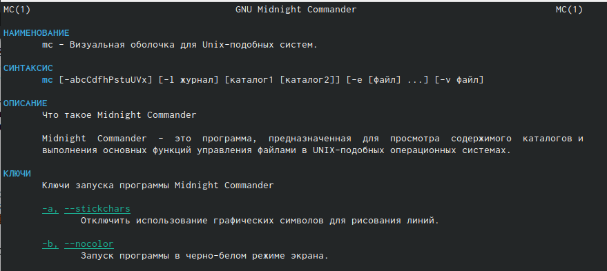{ #fig:001 width=70% }

Запустили из командной строки mc, изучили его структуру и меню.

Выполнили несколько операций в mc, используя управляющие клавиши (операции с панелями; выделение/отмена выделения файлов, копирование/перемещение файлов, получение информации о размере и правах доступа на файлы и/или каталоги
и т.п.).

Выполнили основные команды меню левой (или правой) панели. Оценили степень подробности вывода информации о файлах. (рис. [-@fig:002])

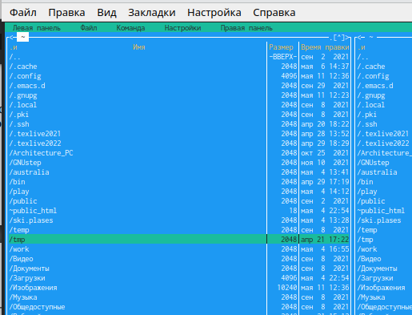{ #fig:002 width=70% }

Используя возможности подменю Файл, выполнили:

– просмотр содержимого текстового файла; (рис. [-@fig:006])

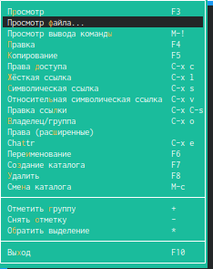{ #fig:006 width=70% }

– редактирование содержимого текстового файла (без сохранения результатов редактирования); (рис. [-@fig:005])

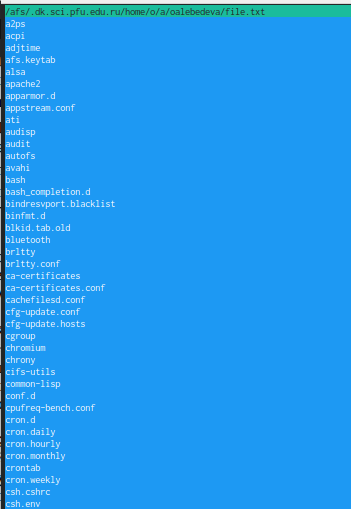{ #fig:005 width=70% }

– создание каталога; (рис. [-@fig:004]) (рис. [-@fig:003])

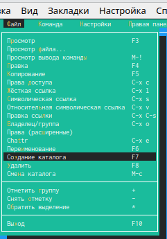{ #fig:004 width=70% }

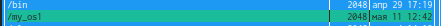{ #fig:003 width=70% }

– копирование в файлов в созданный каталог; (рис. [-@fig:008]) (рис. [-@fig:009])

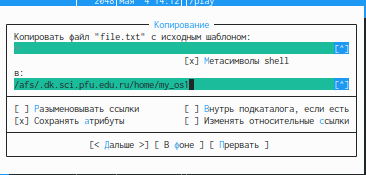{ #fig:008 width=70% }

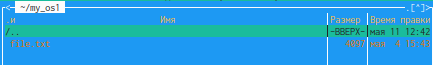{ #fig:009 width=70% }

С помощью соответствующих средств подменю Команда осуществили:

– поиск в файловой системе файла с заданными условиями (например, файла с расширением .c или .cpp, содержащего строку main); (рис. [-@fig:019]) (рис. [-@fig:018])

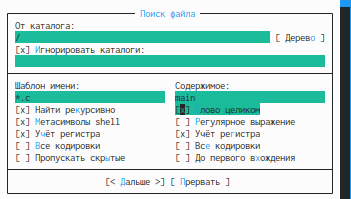{ #fig:018 width=70% }

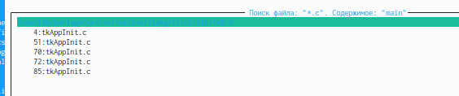{ #fig:019 width=70% }

– выбор и повторение одной из предыдущих команд;

– переход в домашний каталог; (рис. [-@fig:020])

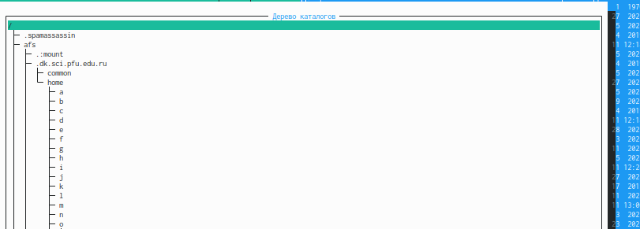{ #fig:020 width=70% }

– анализ файла меню (рис. [-@fig:022]) и файла расширений. (рис. [-@fig:021])

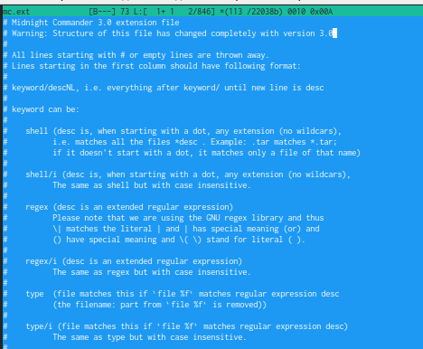{ #fig:021 width=70% }

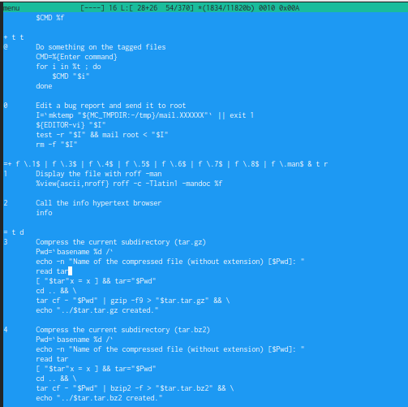{ #fig:022 width=70% }

Вызвали подменю Настройки. Освоили операции, определяющие структуру экрана mc. (рис. [-@fig:023]) (рис. [-@fig:024]) (рис. [-@fig:025]) (рис. [-@fig:026])

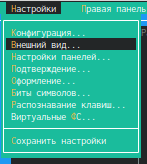{ #fig:023 width=70% }

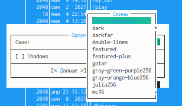{ #fig:024 width=70% }

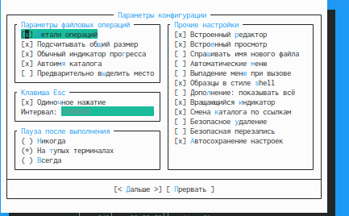{ #fig:025 width=70% }

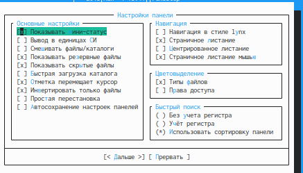{ #fig:026 width=70% }

# Задание 2

1. Создали текстовой файл text.txt. (рис. [-@fig:027])

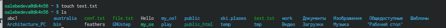{ #fig:027 width=70% }

2. Открыли этот файл с помощью встроенного в mc редактора. Вставили в открытый файл небольшой фрагмент текста, скопированный из любого другого файла или Интернета. (рис. [-@fig:030])

{ #fig:030 width=70% }

3. Проделали с текстом следующие манипуляции, используя горячие клавиши:

- Удалили строку текста. (рис. [-@fig:031])

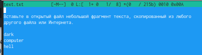{ #fig:031 width=70% }

- Выделили фрагмент текста и скопировали его на новую строку. (рис. [-@fig:032])

{ #fig:032 width=70% }

- Выделили фрагмент текста и перенесли его на новую строку. Сохранили файл. Отменили последнее действие.

- Перешли в конец файла (нажав комбинацию клавиш) и написали некоторый
текст. 

Комбинация клавиш - Ctrl + End

Перешли в начало файла (нажав комбинацию клавиш) и написали некоторый
текст. (рис. [-@fig:036])

Комбинация клавиш - Ctrl + Home 

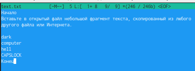{ #fig:036 width=70% }

- Сохранили и закрыли файл.

4. Открыли файл с текстом на некотором языке программирования (например Java). (рис. [-@fig:037])

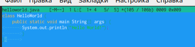{ #fig:037 width=70% }

Используя меню редактора, включили подсветку синтаксиса, если она не включена,
или выключили, если она включена. (рис. [-@fig:038])

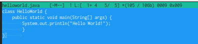{ #fig:038 width=70% }

# Вывод

Освоили основные возможности командной оболочки Midnight Commander. Приобрели навыки практической работы по просмотру каталогов и файлов; манипуляций с ними.

# Контрольные вопросы

1. Какие режимы работы есть в mc. Охарактеризуйте их.

Панель в mc отображает список файлов текущего каталога. Абсолютный путь к этому
каталогу отображается в заголовке панели. У активной панели заголовок и одна из её
строк подсвечиваются. Управление панелями осуществляется с помощью определённых
комбинаций клавиш или пунктов меню mc.

Панели можно поменять местами. Для этого и используется комбинация клавиш Ctrl-u
или команда меню mc Переставить панели . Также можно временно убрать отображение
панелей (отключить их) с помощью комбинации клавиш Ctrl-o или команды меню mc
Отключить панели . Это может быть полезно, например, если необходимо увидеть вывод
какой-то информации на экран после выполнения какой-либо команды shell.

С помощью последовательного применения комбинации клавиш Ctrl-x d есть
возможность сравнения каталогов, отображённых на двух панелях. Панели могут дополнительно быть переведены в один из двух режимов: Информация или Дерево . В режиме
Информация на панель выводятся сведения о файле и текущей файловой системе,
расположенных на активной панели. В режиме Дерево на одной из панелей
выводится структура дерева каталогов.

Управлять режимами отображения панелей можно через пункты меню mc Правая панель
и Левая панель.

2. Какие операции с файлами можно выполнить как с помощью команд shell, так и с помощью меню (комбинаций клавиш) mc? Приведите несколько примеров.

3. Опишите структура меню левой (или правой) панели mc, дайте характеристику командам.

Перейти в строку меню панелей mc можно с помощью функциональной клавиши F9. В строке меню имеются пять меню: Левая панель , Файл , Команда , Настройки и Правая панель.

Подпункт меню Быстрый просмотр позволяет выполнить быстрый просмотр содержимого
панели.

Подпункт меню Информация позволяет посмотреть информацию о файле или каталоге.

В меню каждой (левой или правой) панели можно выбрать Формат списка :

– стандартный — выводит список файлов и каталогов с указанием размера и времени
правки;

– ускоренный — позволяет задать число столбцов, на которые разбивается панель при
выводе списка имён файлов или каталогов без дополнительной информации;

– расширенный — помимо названия файла или каталога выводит сведения о правах
доступа, владельце, группе, размере, времени правки;

– определённый пользователем — позволяет вывести те сведения о файле или каталоге,
которые задаст сам пользователь.

Подпункт меню Порядок сортировки позволяет задать критерии сортировки при выводе
списка файлов и каталогов: без сортировки, по имени, расширенный, время правки,
время доступа, время изменения атрибута, размер, узел.

4. Опишите структура меню Файл mc, дайте характеристику командам.

– Жёсткая ссылка ( Ctrl-x l ) — позволяет создать жёсткую ссылку к текущему (или
выделенному) файлу1.

– Символическая ссылка ( Ctrl-x s ) — позволяет создать символическую ссылку к текущему (или выделенному) файлу2.

– Владелец/группа ( Ctrl-x o ) — позволяет задать (изменить) владельца и имя группы
для одного или нескольких файлов или каталогов.

– Права (расширенные) — позволяет изменить права доступа и владения для одного
или нескольких файлов или каталогов.

– Переименование ( F6 ) — позволяет переименовать (или переместить) один или
несколько файлов или каталогов.

– Создание каталога ( F7 ) — позволяет создать каталог.

– Удалить ( F8 ) — позволяет удалить один или несколько файлов или каталогов.

– Выход ( F10 ) — завершает работу mc.

– Просмотр ( F3 ) — позволяет посмотреть содержимое текущего (или выделенного)
файла без возможности редактирования.

– Просмотр вывода команды ( М + ! ) — функция запроса команды с параметрами (аргумент к текущему выбранному файлу).

– Правка ( F4 ) — открывает текущий (или выделенный) файл для его редактирования.

– Копирование ( F5 ) — осуществляет копирование одного или нескольких файлов или
каталогов в указанное пользователем во всплывающем окне место.

– Права доступа ( Ctrl-x c ) — позволяет указать (изменить) права доступа к одному
или нескольким файлам или каталогам.

5. Опишите структура меню Команда mc, дайте характеристику командам.

– Дерево каталогов — отображает структуру каталогов системы.

– Поиск файла — выполняет поиск файлов по заданным параметрам.

– Переставить панели — меняет местами левую и правую панели.

– Сравнить каталоги ( Ctrl-x d ) — сравнивает содержимое двух каталогов.

– Размеры каталогов — отображает размер и время изменения каталога (по умолчанию
в mc размер каталога корректно не отображается).

– История командной строки — выводит на экран список ранее выполненных в оболочке
команд.

– Каталоги быстрого доступа ( Ctrl-\ ) — пр вызове выполняется быстрая смена текущего
каталога на один из заданного списка.

– Восстановление файлов — позволяет восстановить файлы на файловых системах ext2
и ext3.

– Редактировать файл расширений — позволяет задать с помощью определённого синтаксиса действия при запуске файлов с определённым расширением (например, какое программного обеспечение запускать для открытия или редактирования файлов с расширением doc или docx).

– Редактировать файл меню — позволяет отредактировать контекстное меню пользователя, вызываемое по клавише F2.

– Редактировать файл расцветки имён — позволяет подобрать оптимальную для пользователя расцветку имён файлов в зависимости от их типа.

6. Опишите структура меню Настройки mc, дайте характеристику командам.

– Конфигурация — позволяет скорректировать настройки работы с панелями.

– Внешний вид и Настройки панелей — определяет элементы (строка меню, командная строка, подсказки и прочее), отображаемые при вызове mc, а также геометрию расположения панелей и цветовыделение.

– Биты символов — задаёт формат обработки информации локальным терминалом.

– Подтверждение — позволяет установить или убрать вывод окна с запросом подтверждения действий при операциях удаления и перезаписи файлов, а также при выходе
из программы.

– Распознание клавиш — диалоговое окно используется для тестирования функциональных клавиш, клавиш управления курсором и прочее.

– Виртуальные ФС –– настройки виртуальной файловой системы: тайм-аут, пароль
и прочее.

7. Назовите и дайте характеристику встроенным командам mc.

F1 — Помощь

F2 — Сохранить изменения в файл при редактировании

F3 — Просмотр файла

F3 — (Во время редактирования) Начать выделение текста. Повторное нажатие F3 закончит выделение

F4 — Редактирование файла

F5 — Скопировать выделенное

F6 — Переместить выделенное

F8 — Удалить выделенное  

Shift+F1 — вызывается меню быстрого перехода между точками монтирования на левой панели

Shift+F2 — вызывается меню быстрого перехода между точками монтирования на правой панели

Shift+F5 — скопировать файл в этот же каталог

Shift+F6 — переместить/переименовать файл в этот же каталог

Поиск
ctrl-s — Быстрый поиск файла или каталога

alt-shift-? — Вызывается меню расширенного поиска файлов
