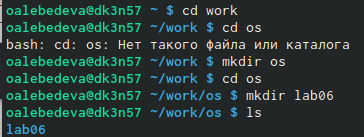
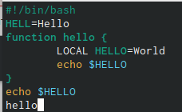
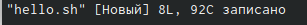
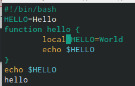
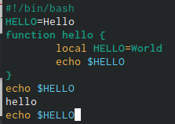
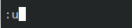
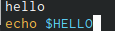
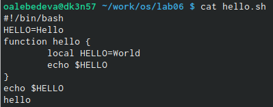
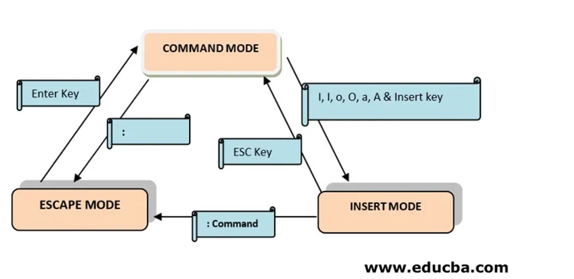

---
## Front matter
title: "Лабораторная работа №8"
subtitle: "Текстовый редактор vi"
author: "Лебедева Ольга Андреевна"

## Generic otions
lang: ru-RU
toc-title: "Содержание"

## Bibliography
bibliography: bib/cite.bib
csl: pandoc/csl/gost-r-7-0-5-2008-numeric.csl

## Pdf output format
toc: true # Table of contents
toc-depth: 2
lof: true # List of figures
lot: true # List of tables
fontsize: 12pt
linestretch: 1.5
papersize: a4
documentclass: scrreprt
## I18n polyglossia
polyglossia-lang:
  name: russian
  options:
	- spelling=modern
	- babelshorthands=true
polyglossia-otherlangs:
  name: english
## I18n babel
babel-lang: russian
babel-otherlangs: english
## Fonts
mainfont: PT Serif
romanfont: PT Serif
sansfont: PT Sans
monofont: PT Mono
mainfontoptions: Ligatures=TeX
romanfontoptions: Ligatures=TeX
sansfontoptions: Ligatures=TeX,Scale=MatchLowercase
monofontoptions: Scale=MatchLowercase,Scale=0.9
## Biblatex
biblatex: true
biblio-style: "gost-numeric"
biblatexoptions:
  - parentracker=true
  - backend=biber
  - hyperref=auto
  - language=auto
  - autolang=other*
  - citestyle=gost-numeric
## Pandoc-crossref LaTeX customization
figureTitle: "Рис."
tableTitle: "Таблица"
listingTitle: "Листинг"
lofTitle: "Список иллюстраций"
lotTitle: "Список таблиц"
lolTitle: "Листинги"
## Misc options
indent: true
header-includes:
  - \usepackage{indentfirst}
  - \usepackage{float} # keep figures where there are in the text
  - \floatplacement{figure}{H} # keep figures where there are in the text
---

# Цель работы

Познакомиться с операционной системой Linux. Получить практические навыки работы с редактором vi, установленным по умолчанию практически во всех дистрибутивах.

# Теоретическое введение

В большинстве дистрибутивов Linux в качестве текстового редактора по умолчанию
устанавливается интерактивный экранный редактор vi (Visual display editor).

Редактор vi имеет три режима работы:

– командный режим — предназначен для ввода команд редактирования и навигации по
редактируемому файлу;

– режим вставки — предназначен для ввода содержания редактируемого файла;

– режим последней (или командной) строки — используется для записи изменений в файл
и выхода из редактора.

Для вызова редактора vi необходимо указать команду vi и имя редактируемого файла:
vi <имя_файла>

При этом в случае отсутствия файла с указанным именем будет создан такой файл.

Переход в командный режим осуществляется нажатием клавиши Esc . Для выхода из
редактора vi необходимо перейти в режим последней строки: находясь в командном
режиме, нажать Shift-; (по сути символ : — двоеточие), затем:

– набрать символы wq, если перед выходом из редактора требуется записать изменения
в файл;

– набрать символ q (или q!), если требуется выйти из редактора без сохранения.

# Ход работы
# Задание 1

Создали каталог с именем ~/work/os/lab06.
(рис. [-@fig:001])

{ #fig:001 width=70% }

Перешли во вновь созданный каталог.

Вызвали vi и создали файл hello.sh. (рис. [-@fig:002])

{ #fig:002 width=70% }

Нажали клавишу i и ввели следующий текст. (рис. [-@fig:003])

{ #fig:003 width=70% }

Нажали клавишу Esc для перехода в командный режим после завершения ввода текста.

Нажали : для перехода в режим последней строки и внизу нашего экрана появилось приглашение в виде двоеточия.

Нажали w (записать) и q (выйти), а затем нажали клавишу Enter для сохранения нашего текста и завершения работы. (рис. [-@fig:004]) (рис. [-@fig:005])

{ #fig:004 width=70% }

{ #fig:005 width=70% }

Сделали файл исполняемым. (рис. [-@fig:006])

{ #fig:006 width=70% }

# Задание 2

Вызвали vi на редактирование файла.

Установили курсор в конец слова HELL второй строки. 

Перешли в режим вставки и заменили на HELLO. Нажали Esc для возврата в командный режим.
(рис. [-@fig:008])

{ #fig:008 width=70% }

Установили курсор на четвертую строку и стерли слово LOCAL.

Перешли в режим вставки и набрали следующий текст: local, нажали Esc для
возврата в командный режим.

Установили курсор на последней строке файла. Вставили после неё строку, содержащую
следующий текст: echo $HELLO. (рис. [-@fig:009])

{ #fig:009 width=70% }

Нажали Esc для перехода в командный режим.

Удалили последнюю строку.

Ввели команду отмены изменений u для отмены последней команды.(рис. [-@fig:010]) (рис. [-@fig:011])

{ #fig:010 width=70% }

{ #fig:011 width=70% }

Ввели символ : для перехода в режим последней строки. Записали произведённые изменения и вышли из vi. (рис. [-@fig:012])

{ #fig:012 width=70% }

# Вывод

Познакомились с операционной системой Linux. Получили практические навыки работы с редактором vi, установленным по умолчанию практически во всех дистрибутивах.

# Контрольные вопросы

1. Дайте краткую характеристику режимам работы редактора vi.

В любой момент при работе в редакторе vi вы находитесь в одном из трёх режимов редактора: командный режим (command mode), режим ввода (insert mode) и режим последней строки (last line mode).

При запуске редактора vi вы оказываетесь в командном режиме. В этом режиме можно давать команды для редактирования файлов или перейти в другой режим.

Основной ввод и редактирование текста осуществляется в режиме ввода. 

Режим последней строки — это специальный режим, в котором редактору даются сложные команды.

2. Как выйти из редактора, не сохраняя произведённые изменения?

Если необходимо просто выйти Vi (без сохранения выполненных изменений), то необходимо в последней строке набрать символ q (или q!).

3. Назовите и дайте краткую характеристику командам позиционирования.

Команды позиционирования:

0 (ноль)- перейти в начало строки;

$ - перейти в конец строки;

G- перейти в конец файла;

nG или :n - перейти на строку номер n.

4. Что для редактора vi является словом?

Редактор vi предполагает, что слово - это строка символов, которая может включать в себя буквы, цифры и символы подчеркивания.

5. Каким образом из любого места редактируемого файла перейти в начало (конец) файла?

gg - перейти в начало файла;
G - перейти в конец файла.

6. Назовите и дайте краткую характеристику основным группам команд редактирования.

Вставка строки:

о - вставить строку под курсором;

О- вставить строку над курсором.

Удаление текста:

x - удалить один символ в буфер;

dw - удалить одно слово в буфер;

Отмена и повтор произведенных изменений:

u - отменить последнее изменение;

. - повторить последнее изменение.

Копирование текста в буфер:

v – перейти в визуальный режим;

Замена текста:

cw - заменить слово;

ncw - заменить n слов.

7. Необходимо заполнить строку символами $. Каковы ваши действия?

Создаем файл, открываем его для редактирования в vi. Нажимаем i и начинаем записывать строку $. Далее нажимаем Esc для перехода в другой режим и сохраняем, вводя после доветочия wq.

8. Как отменить некорректное действие, связанное с процессом редактирования?

:e! - вернуться в командный режим, отменив все изменения, произведенные со времени последней записи.

u - отменить последнее изменение.

9. Назовите и дайте характеристику основным группам команд режима последней строки.

Команды редактирования в режиме последней строки

Копирование и перемещение текста:

:i,jd - удалить строки с i по j, например :3,8d

:i,jm k - переместить строки с i по j, начиная со строки k, например :4,9m 12

:i,jt k - копировать строки с i по j, начиная со строки k, например :2,5 t 13

:i,jw имя_файла - записать строки с i по j в файл с именем имя_файла, например :5,9 test.txt

10. Как определить, не перемещая курсора, позицию, в которой заканчивается строка?

Вы можете позиционировать курсор по буферу.

11. Выполните анализ опций редактора vi (сколько их, как узнать их назначение и т.д.).

Команда vi имеет специальные опции. Они позволяют:

восстановить потерянный файл, если работа vi была прервана;

поместить в буфер редактирования несколько файлов и редактировать их по порядку;

просмотр файла без риска случайного внесения изменений в него.

12. Как определить режим работы редактора vi?

Нажать клавишу Esc.

13. Постройте граф взаимосвязи режимов работы редактора vi. (рис. [-@fig:013])

{ #fig:013 width=70% }
