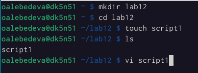
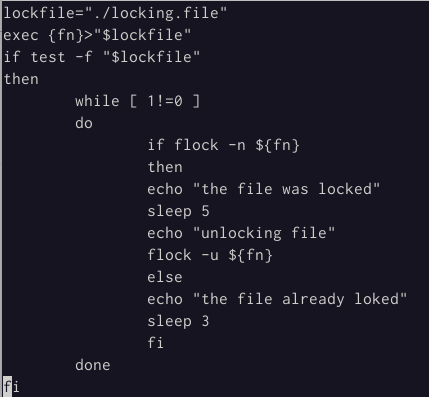
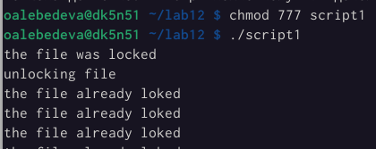
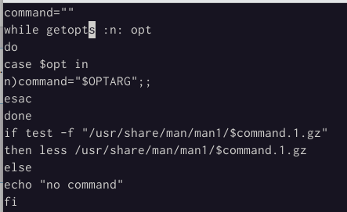
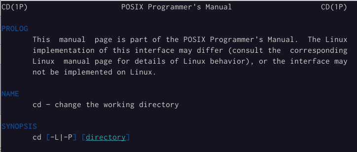
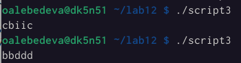

---
## Front matter
lang: ru-RU
title: Программирование в командном процессоре ОС UNIX. Расширенное программирование
author: |
	Лебедева Ольга Андреевна
institute: |
	\inst{1}RUDN University, Moscow, Russian Federation

## Formatting
toc: false
slide_level: 2
theme: metropolis
header-includes: 
 - \metroset{progressbar=frametitle,sectionpage=progressbar,numbering=fraction}
 - '\makeatletter'
 - '\beamer@ignorenonframefalse'
 - '\makeatother'
aspectratio: 43
section-titles: true
---

## Цель работы

Изучить основы программирования в оболочке ОС UNIX. Научиться писать более сложные командные файлы с использованием логических управляющих конструкций и циклов.

## Теоретическое введение

$RANDOM -- внутренняя функция Bash (не константа), которая возвращает псевдослучайные целые числа в диапазоне 0 - 32767. Функция $RANDOM не должна использоваться для генераци ключей шифрования.

## Ход работы

1 . Написали командный файл, реализующий упрощённый механизм семафоров. Командный файл должен в течение некоторого времени t1 дожидаться освобождения ресурса, выдавая об этом сообщение, а дождавшись его освобождения, использовать его в течение некоторого времени t2<>t1, также выдавая информацию о том, что ресурс используется соответствующим командным файлом (процессом). Запустили командный файл в одном виртуальном терминале в фоновом режиме, перенаправив его вывод в другой (> /dev/tty#, где # — номер терминала куда перенаправляется вывод), в котором также запущен этот файл, но не фоновом, а в привилегированном режиме. Доработали программу так, чтобы имелась возможность взаимодействия трёх и более процессов. (рис. [-@fig:001]) (рис. [-@fig:002]) (рис. [-@fig:003])

##

{ #fig:001 width=40% }

{ #fig:002 width=40% }

## Задание 1

{ #fig:003 width=40% }

## Задание 2

2 . Реализовали команду man с помощью командного файла. Изучили содержимое каталога /usr/share/man/man1. В нем находятся архивы текстовых файлов, содержащих справку по большинству установленных в системе программ и команд. Каждый архив можно открыть командой less сразу же просмотрев содержимое справки. Командный файл должен получать в виде аргумента командной строки название команды и в виде результата выдавать справку об этой команде или сообщение об отсутствии справки, если соответствующего файла нет в каталоге man1. (рис. [-@fig:004]) (рис. [-@fig:005]) (рис. [-@fig:006])

##

{ #fig:004 width=40% }

{ #fig:006 width=40% }

{ #fig:005 width=40% }

## Задание 3

3 . Используя встроенную переменную $RANDOM, написали командный файл, генерирующий случайную последовательность букв латинского алфавита. Учли, что $RANDOM выдаёт псевдослучайные числа в диапазоне от 0 до 32767. (рис. [-@fig:007]) (рис. [-@fig:008])

{ #fig:007 width=70% }

{ #fig:008 width=70% }

## Вывод

Изучили основы программирования в оболочке ОС UNIX. Научились писать более сложные командные файлы с использованием логических управляющих конструкций и циклов.
