---
## Front matter
title: "Лабораторная работа №13"
subtitle: "Средства, применяемые при разработке программного обеспечения в ОС типа UNIX/Linux"
author: "Лебедева Ольга Андреевна"

## Generic otions
lang: ru-RU
toc-title: "Содержание"

## Bibliography
bibliography: bib/cite.bib
csl: pandoc/csl/gost-r-7-0-5-2008-numeric.csl

## Pdf output format
toc: true # Table of contents
toc-depth: 2
lof: true # List of figures
lot: true # List of tables
fontsize: 12pt
linestretch: 1.5
papersize: a4
documentclass: scrreprt
## I18n polyglossia
polyglossia-lang:
  name: russian
  options:
	- spelling=modern
	- babelshorthands=true
polyglossia-otherlangs:
  name: english
## I18n babel
babel-lang: russian
babel-otherlangs: english
## Fonts
mainfont: PT Serif
romanfont: PT Serif
sansfont: PT Sans
monofont: PT Mono
mainfontoptions: Ligatures=TeX
romanfontoptions: Ligatures=TeX
sansfontoptions: Ligatures=TeX,Scale=MatchLowercase
monofontoptions: Scale=MatchLowercase,Scale=0.9
## Biblatex
biblatex: true
biblio-style: "gost-numeric"
biblatexoptions:
  - parentracker=true
  - backend=biber
  - hyperref=auto
  - language=auto
  - autolang=other*
  - citestyle=gost-numeric
## Pandoc-crossref LaTeX customization
figureTitle: "Рис."
tableTitle: "Таблица"
listingTitle: "Листинг"
lofTitle: "Список иллюстраций"
lotTitle: "Список таблиц"
lolTitle: "Листинги"
## Misc options
indent: true
header-includes:
  - \usepackage{indentfirst}
  - \usepackage{float} # keep figures where there are in the text
  - \floatplacement{figure}{H} # keep figures where there are in the text
---

# Цель работы 

Приобрести простейшие навыки разработки, анализа, тестирования и отладки приложений в ОС типа UNIX/Linux на примере создания на языке программирования калькулятора с простейшими функциями.

# Теоретическое введение

Процесс разработки программного обеспечения обычно разделяется на следующие
этапы:

- планирование, включающее сбор и анализ требований к функционалу и другим характеристикам разрабатываемого приложения;

- проектирование, включающее в себя разработку базовых алгоритмов и спецификаций, определение языка программирования;

Непосредственная разработка приложения:

- кодирование — по сути создание исходного текста программы (возможно
в нескольких вариантах);

- анализ разработанного кода;

- сборка, компиляция и разработка исполняемого модуля;

- тестирование и отладка, сохранение произведённых изменений;

- документирование.

Для создания исходного текста программы разработчик может воспользоваться любым удобным для него редактором текста: vi, vim, mceditor, emacs, geany и др.

# Ход работы

В домашнем каталоге создали подкаталог ~/work/os/lab_prog. Создали в нём файлы: calculate.h, calculate.c, main.c.(рис. [-@fig:001])

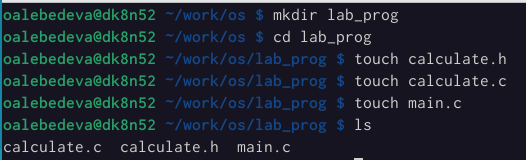{ #fig:001 width=70% }

Записали код в три созданных файла. (рис. [-@fig:002]) (рис. [-@fig:003]) (рис. [-@fig:004])

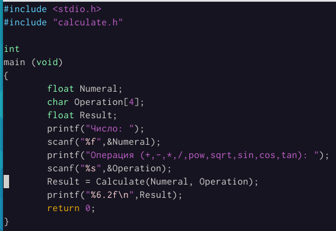{ #fig:002 width=70% }

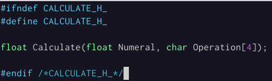{ #fig:003 width=70% }

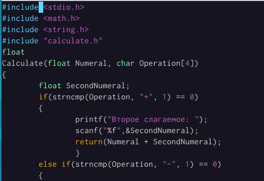{ #fig:004 width=70% }

Выполнили компиляцию программы посредством gcc: (рис. [-@fig:005])

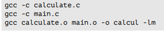{ #fig:005 width=70% }

Проверили все файлы на наличие. (рис. [-@fig:006])

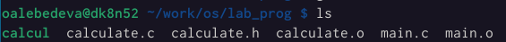{ #fig:006 width=70% }

Исправили синтаксические ошибки в созданном Makefile. (рис. [-@fig:007])

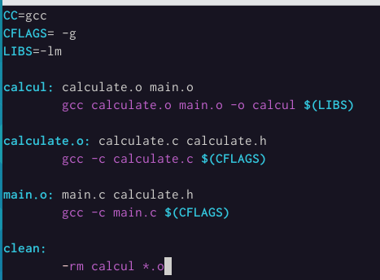{ #fig:007 width=70% }

Запустили отладчик GDB, загрузив в него программу для отладки: (рис. [-@fig:008])

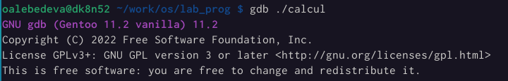{ #fig:008 width=70% }

Для запуска программы внутри отладчика ввели команду run: (рис. [-@fig:009])

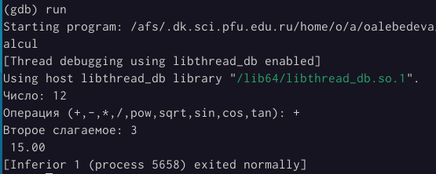{ #fig:009 width=70% }

Для постраничного (по 9 строк) просмотра исходного код использовали команду list. (рис. [-@fig:010])

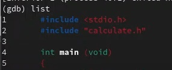{ #fig:010 width=70% }

Для просмотра строк с 12 по 15 основного файла использjdfkb list с параметрами: (рис. [-@fig:011])

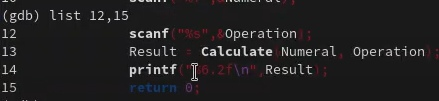{ #fig:011 width=70% }

Для просмотра определённых строк не основного файла использовали list с параметрами: (рис. [-@fig:012])

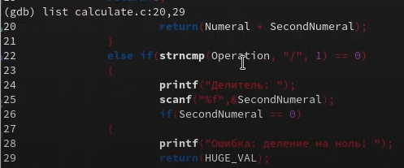{ #fig:012 width=70% }

Установили точку останова в файле calculate.c на строке номер 21: (рис. [-@fig:013])

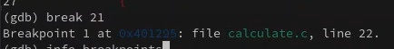{ #fig:013 width=70% }

Вывели информацию об имеющихся в проекте точка останова. Запустили программу. (рис. [-@fig:014])

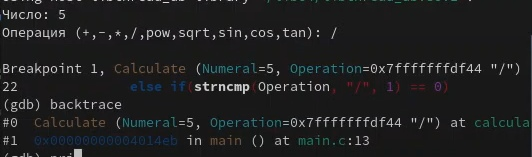{ #fig:014 width=70% }

Посмотрели, чему равно на этом этапе значение переменной Numeral. (рис. [-@fig:015]) 

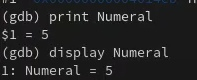{ #fig:015 width=70% }

Удалили точку останова. (рис. [-@fig:016]) 

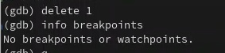{ #fig:016 width=70% }

С помощью утилиты splint проанализировали коды файлов calculate.c и main.c. (рис. [-@fig:017]) (рис. [-@fig:018])

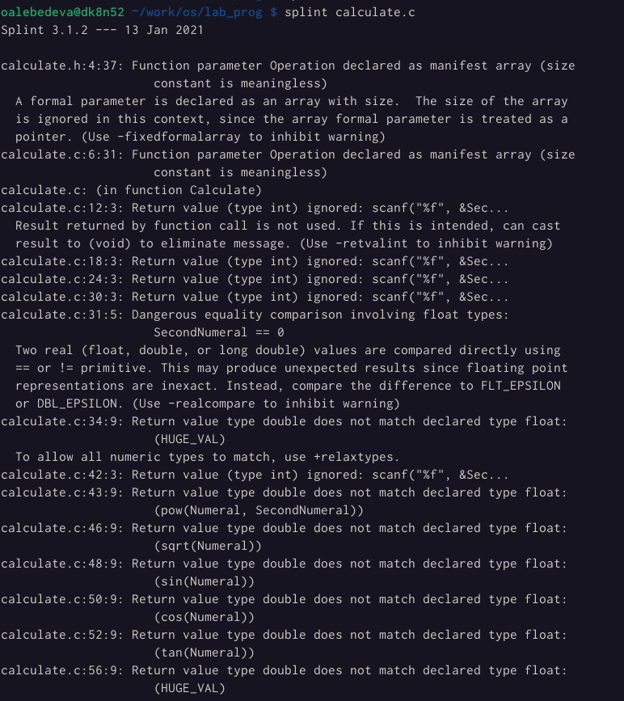{ #fig:017 width=70% }

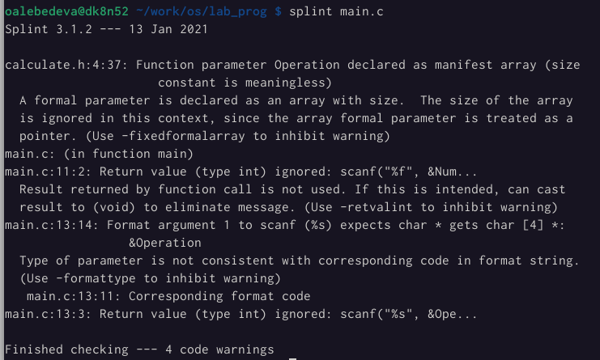{ #fig:018 width=70% }

# Вывод

Приобрели простейшие навыки разработки, анализа, тестирования и отладки приложений в ОС типа UNIX/Linux на примере создания на языке программирования калькулятора с простейшими функциями.

# Ответы на вопросы

1. Как получить информацию о возможностях программ gcc, make, gdb и др.?

Дополнительную информацию о этих программах можно получить с помощью функций info и man.

2. Назовите и дайте краткую характеристику основным этапам разработки приложений в UNIX.

Unix поддерживает следующие основные этапы разработки приложений:

- создание исходного кода программы;

- редставляется в виде файла;

- сохранение различных вариантов исходного текста;

- анализ исходного текста; Необходимо отслеживать изменения исходного кода, а также при работе более двух программистов над проектом программы нужно, чтобы они не делали изменений кода в одно время.

- компиляция исходного текста и построение исполняемого модуля;

- тестирование и отладка;

- проверка кода на наличие ошибок

- сохранение всех изменений, выполняемых при тестировании и отладке.

3. Что такое суффикс в контексте языка программирования? Приведите примеры использования.

Использование суффикса ".с" для имени файла с программой на языке Си отражает удобное и полезное соглашение, принятое в ОС UNIX. Для любого имени входного файла суффикс определяет какая компиляция требуется. Суффиксы и префиксы указывают тип объекта. Одно из полезных свойств компилятора Си — его способность по суффиксам определять типы файлов. По суффиксу .c компилятор распознает, что файл abcd.c должен компилироваться, а по суффиксу .o, что файл abcd.о является объектным модулем и для получения исполняемой программы необходимо выполнить редактирование связей. Простейший пример командной строки для компиляции программы abcd.c и построения исполняемого модуля abcd имеет вид: gcc -o abcd abcd.c. Некоторые проекты предпочитают показывать префиксы в начале текста изменений для старых (old) и новых (new) файлов. Опция – prefix может быть использована для установки такого префикса. Плюс к этому команда bzr diff -p1 выводит префиксы в форме которая подходит для команды patch -p1.

4. Каково основное назначение компилятора языка С в UNIX?

Основное назначение компилятора с языка Си заключается в компиляции всей программы в целом и получении исполняемого модуля.

5. Для чего предназначена утилита make?

При разработке большой программы, состоящей из нескольких исходных файлов заголовков, приходится постоянно следить за файлами, которые требуют перекомпиляции после внесения изменений. Программа make освобождает пользователя от такой рутинной работы и служит для документирования взаимосвязей между файлами. Описание взаимосвязей и соответствующих действий хранится в так называемом make-файле, который по умолчанию имеет имя makefile или Makefile.

6. Приведите пример структуры Makefile. Дайте характеристику основным элементам этого файла.

7. Назовите основное свойство, присущее всем программам отладки. Что необходимо сделать, чтобы его можно было использовать?

Пошаговая отладка программ заключается в том, что выполняется один оператор программы и, затем контролируются те переменные, на которые должен был воздействовать данный оператор. Если в программе имеются уже отлаженные подпрограммы, то подпрограмму можно рассматривать, как один оператор программы и воспользоваться вторым способом отладки программ. Если в программе существует достаточно большой участок программы, уже отлаженный ранее, то его можно выполнить, не контролируя переменные, на которые он воздействует. Использование точек останова позволяет пропускать уже отлаженную часть программы. Точка останова устанавливается в местах, где необходимо проверить содержимое переменных или просто проконтролировать, передаётся ли управление данному оператору. Практически во всех отладчиках поддерживается это свойство (а также выполнение программы до курсора и выход из подпрограммы). Затем отладка программы продолжается в пошаговом режиме с контролем локальных и глобальных переменных, а также внутренних регистров микроконтроллера и напряжений на выводах этой микросхемы. 8. Назовите и дайте основную характеристику основным командам отладчика gdb. – backtrace – выводит весь путь к текущей точке останова, то есть названия всех функций, начиная от main(); иными словами, выводит весь стек функций; – break – устанавливает точку останова; параметром может быть номер строки или название функции;

- clear – удаляет все точки останова на текущем уровне стека (то есть в текущей функции);

- continue – продолжает выполнение программы от текущей точки до конца;

- delete – удаляет точку останова или контрольное выражение;

- display – добавляет выражение в список выражений, значения которых отображаются каждый раз при остановке программы;

- finish – выполняет программу до выхода из текущей функции; отображает возвращаемое значение,если такое имеется;

- info breakpoints – выводит список всех имеющихся точек останова; – info watchpoints – выводит список всех имеющихся контрольных выражений;

- splist – выводит исходный код; в качестве параметра передаются название файла исходного кода, затем, через двоеточие, номер начальной и конечной строки; – next – пошаговое выполнение программы, но, в отличие от команды step, не выполняет пошагово вызываемые функции;

- print – выводит значение какого-либо выражения (выражение передаётся в качестве параметра);

- run – запускает программу на выполнение;

- set – устанавливает новое значение переменной

- step – пошаговое выполнение программы;

- watch – устанавливает контрольное выражение, программа остановится, как только значение контрольного выражения изменится;

8. Назовите и дайте основную характеристику основным командам отладчика gdb.

- break или b - создание точки останова;

- info или i - вывести информацию, доступные значения: break, registers, frame, locals, args;

- run или r - запустить программу;

- continue или c - продолжить выполнение программы после точки останова;

9. Опишите по шагам схему отладки программы, которую Вы использовали при выполнении лабораторной работы.

10. Прокомментируйте реакцию компилятора на синтаксические ошибки в программе
при его первом запуске.

Отладчику не понравился формат %s для &Operation, т.к %s — символьный формат, а значит необходим только Operation.

