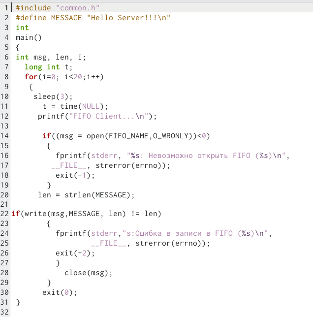

---
## Front matter
lang: ru-RU
title: Именованные каналы
author: |
	Лебедева Ольга Андреевна
institute: |
	\inst{1}RUDN University, Moscow, Russian Federation

## Formatting
toc: false
slide_level: 2
theme: metropolis
header-includes: 
 - \metroset{progressbar=frametitle,sectionpage=progressbar,numbering=fraction}
 - '\makeatletter'
 - '\beamer@ignorenonframefalse'
 - '\makeatother'
aspectratio: 43
section-titles: true
---

## Цель работы 

Приобретение практических навыков работы с именованными каналами.

## Теоретическое введение

Одним из видов взаимодействия между процессами в операционных системах является обмен сообщениями. Под сообщением понимается последовательность байтов, передаваемая от одного процесса другому.

В операционных системах типа UNIX есть 3 вида межпроцессорных взаимодействий: общеюниксные (именованные каналы, сигналы), System V Interface Definition (SVID — разделяемая память, очередь сообщений, семафоры) и BSD (сокеты).

## Теоретическое введение

Для передачи данных между неродственными процессами можно использовать механизм именованных каналов (named pipes). Данные передаются по принципу FIFO (First In First Out) (первым записан — первым прочитан), поэтому они называются также FIFO pipes или просто FIFO. Именованные каналы отличаются от неименованных наличием идентификатора канала, который представлен как специальный файл (соответственно имя именованного канала — это имя файла). Поскольку файл находится на локальной файловой системе, данное IPC используется внутри одной системы.

## Ход работы

Задание :

1. Работает не 1 клиент, а несколько (например, два).

2. Клиенты передают текущее время с некоторой периодичностью (например, раз в пять секунд). Используйте функцию sleep() для приостановки работы клиента.

3. Сервер работает не бесконечно, а прекращает работу через некоторое время (например, 30 сек). Используйте функцию clock() для определения времени работы сервера.

## Ход работы

Сначала мы создали необходимые файлы, записав код через редактор emacs.(рис. [-@fig:001])

{ #fig:001 width=70% }

## Ход работы

Далее, мы написали код в каждый из файлов. (рис. [-@fig:002]) (рис. [-@fig:003]) (рис. [-@fig:004]) (рис. [-@fig:005]) (рис. [-@fig:006])

{ #fig:002 width=70% }

## Ход работы

{ #fig:003 width=70% }

## Ход работы

{ #fig:004 width=70% }

## Ход работы

{ #fig:005 width=70% }

## Ход работы

{ #fig:006 width=70% }

## Ход работы

Запустили Makefile. (рис. [-@fig:007])

{ #fig:007 width=70% }

## Ход работы

Открыли второй терминал. В одном из них запустили server, в другом - client. (рис. [-@fig:008])

{ #fig:008 width=70% }

## Вывод 

Приобрели практические навыки работы с именованными каналами.
