---
# Front matter
lang: ru-RU

## Formatting
toc: false
slide_level: 2
theme: metropolis
header-includes: 
 - \metroset{progressbar=frametitle,sectionpage=progressbar,numbering=fraction}
 - '\makeatletter'
 - '\beamer@ignorenonframefalse'
 - '\makeatother'
aspectratio: 43
section-titles: true
---

# Индивидуальный проект. Часть 1

## Цель работы
Размещение на Github pages заготовки для персонального сайта.

- Установить необходимое программное обеспечение.
- Скачать шаблон темы сайта.
- Разместить его на хостинге git.
- Установить параметр для URLs сайта.
- Разместить заготовку сайта на Github pages.

## Ход работы

Скачали исполняемй файл Hugo, чтобы генерировать страницы сайта. (рис. [-@fig:001]) (рис. [-@fig:002])

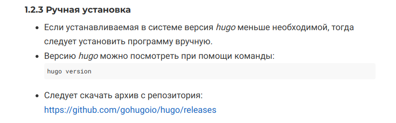{ #fig:001 width=70% }

{ #fig:002 width=70% }

##

Разархивируем файл, создадим папку bin и скопируем файл hugo туда. (рис. [-@fig:004])

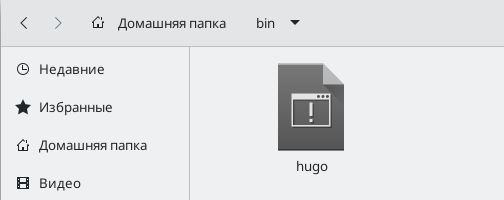{ #fig:004 width=70% }

Далее необходимо создать репозиторий. Находим его на сайте ТУИС.(рис. [-@fig:006])

{ #fig:006 width=70% }

##

Создаем репозиторий с именем blog. (рис. [-@fig:007])

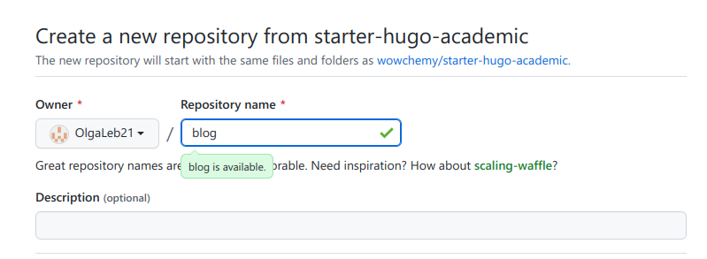{ #fig:007 width=70% }

Клонируем репозиторий через консоль.(рис. [-@fig:003]) (рис. [-@fig:008])

{ #fig:003 width=70% }

{ #fig:008 width=70% }

##

Заходим в blog, смотрим файлы. (рис. [-@fig:009])

{ #fig:009 width=70% }

Выполняем команду ~/bin/hugo. (рис. [-@fig:010])

{ #fig:010 width=70% }

##

Появился каталог public, его пока удалим. (рис. [-@fig:011]) (рис. [-@fig:012]) (рис. [-@fig:013])

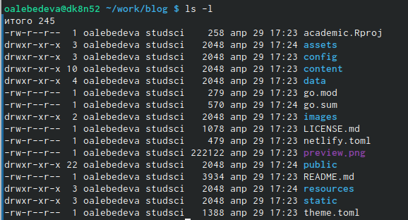{ #fig:011 width=70% }

!Удаление public](image/12.png){ #fig:012 width=70% }

{ #fig:013 width=70% }

##

Выполняем команду ~/bin/hugo server. У нас появится ссылка, переходим по ней. (рис. [-@fig:014])

{ #fig:014 width=70% }

##

В браузере появился сайт. Необходимо убрать зеленый фон. Для этого на сайте есть инструкция. Сделаем необходимые действия, после которых цвет изменится на белый.

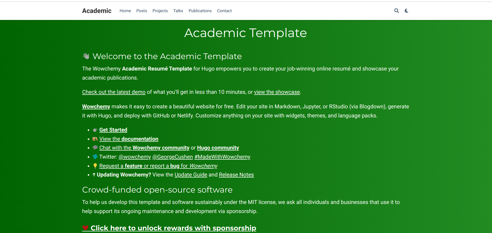{ #fig:015 width=70% }

##

Перейдём в Гитхаб и создадим новый репозиторий. Зададим специальное название как имя пользователя. (рис. [-@fig:016])

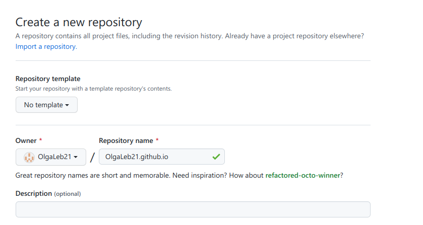{ #fig:016 width=70% }

Клонируем его через консоль. (рис. [-@fig:017])

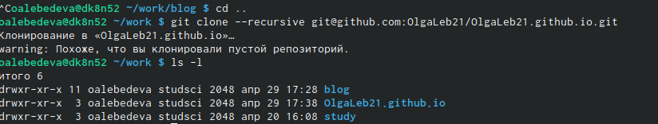{ #fig:017 width=70% }

##

Создадим новую ветку main. (рис. [-@fig:018])

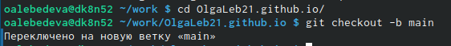{ #fig:018 width=70% }

Создадим новый файл README.md и отправляем его в репозиторий. (рис. [-@fig:019])

{ #fig:019 width=70% }

##

Проверяем наличие файла. (рис. [-@fig:020])

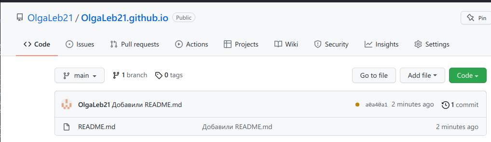{ #fig:020 width=70% }

Создаём каталог public. Мы увидим, что существует игнорируемые каталоги. (рис. [-@fig:021])

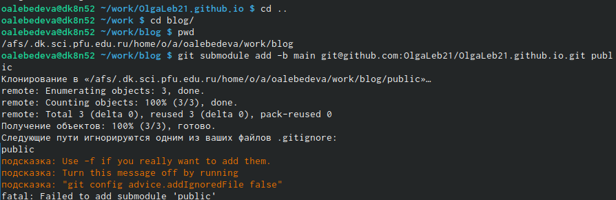{ #fig:021 width=70% }

##

Исправим это, добавив #. (рис. [-@fig:022])

{ #fig:022 width=70% }

После комментария каталоги игнорироваться не будут. (рис. [-@fig:023])

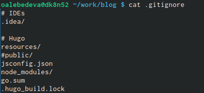{ #fig:023 width=70% }

##

Повторяем ранее введенную команду, public добавляется в index.  (рис. [-@fig:024])

{ #fig:024 width=70% }

Еще проверим, что каталог подключен к репозиторию. (рис. [-@fig:025])

{ #fig:025 width=70% }

##

Далее проделываем стандартные действия, чтобы отправить файлы в репозиторий. (рис. [-@fig:026]) (рис. [-@fig:026])

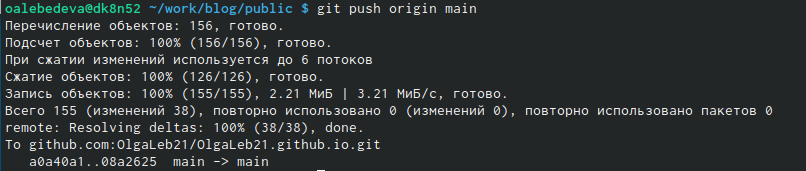{ #fig:026 width=70% }

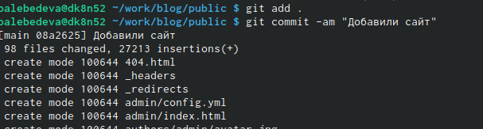{ #fig:027 width=70% }

##

В репозитории появились новые файлы. (рис. [-@fig:028])

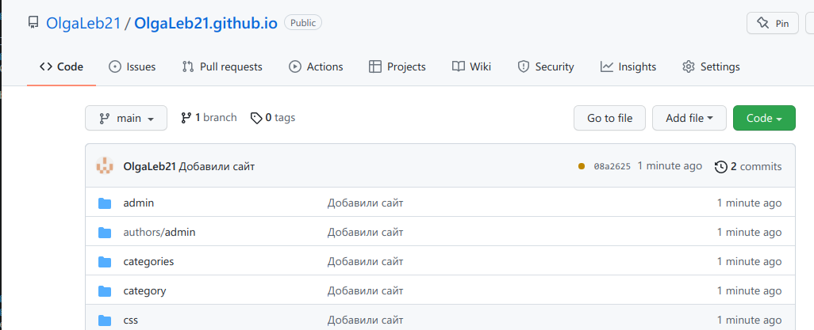{ #fig:028 width=70% }

##

Сайт создан. (рис. [-@fig:029])

{ #fig:029 width=70% }

## Вывод
- Установили необходимое программное обеспечение.
- Скачали шаблон темы сайта.
- Разместили его на хостинге git.
- Установили параметр для URLs сайта.
- Разместили заготовку сайта на Github pages.
