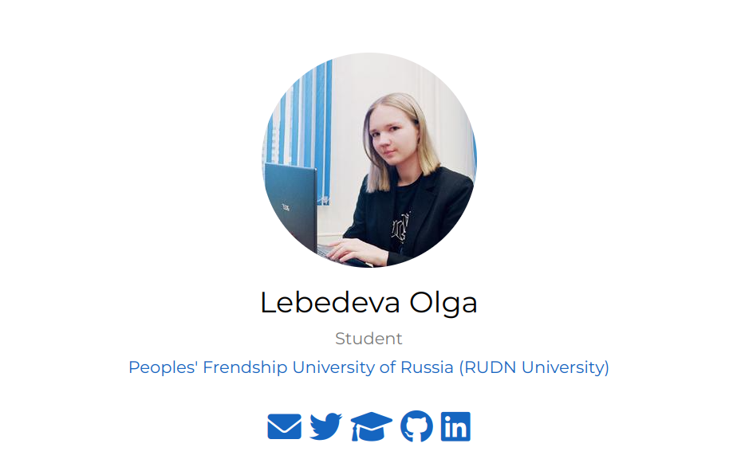
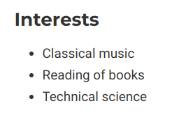
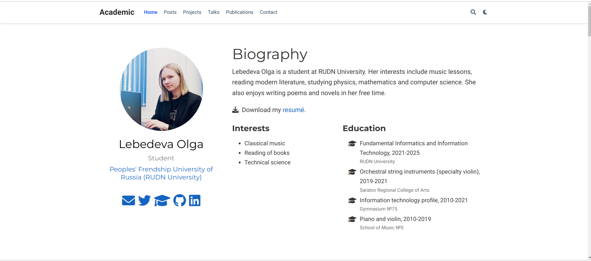
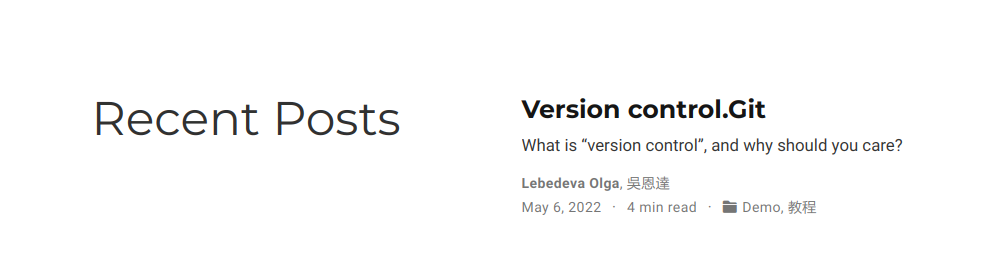
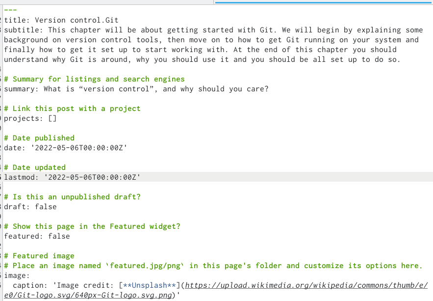
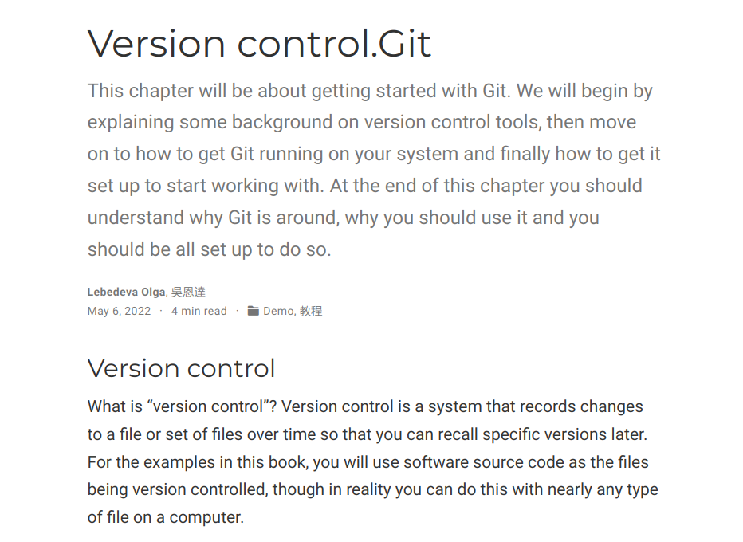
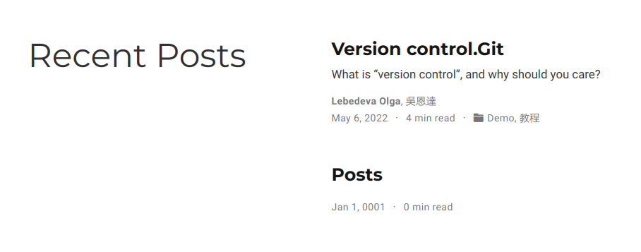

---
## Front matter
title: "Индивидуальный проект. Часть 2"
subtitle: "Создание сайта"
author: "Лебедева Ольга Андреевна"

## Generic otions
lang: ru-RU
toc-title: "Содержание"

## Bibliography
bibliography: bib/cite.bib
csl: pandoc/csl/gost-r-7-0-5-2008-numeric.csl

## Pdf output format
toc: true # Table of contents
toc-depth: 2
lof: true # List of figures
lot: true # List of tables
fontsize: 12pt
linestretch: 1.5
papersize: a4
documentclass: scrreprt
## I18n polyglossia
polyglossia-lang:
  name: russian
  options:
	- spelling=modern
	- babelshorthands=true
polyglossia-otherlangs:
  name: english
## I18n babel
babel-lang: russian
babel-otherlangs: english
## Fonts
mainfont: PT Serif
romanfont: PT Serif
sansfont: PT Sans
monofont: PT Mono
mainfontoptions: Ligatures=TeX
romanfontoptions: Ligatures=TeX
sansfontoptions: Ligatures=TeX,Scale=MatchLowercase
monofontoptions: Scale=MatchLowercase,Scale=0.9
## Biblatex
biblatex: true
biblio-style: "gost-numeric"
biblatexoptions:
  - parentracker=true
  - backend=biber
  - hyperref=auto
  - language=auto
  - autolang=other*
  - citestyle=gost-numeric
## Pandoc-crossref LaTeX customization
figureTitle: "Рис."
tableTitle: "Таблица"
listingTitle: "Листинг"
lofTitle: "Список иллюстраций"
lotTitle: "Список таблиц"
lolTitle: "Листинги"
## Misc options
indent: true
header-includes:
  - \usepackage{indentfirst}
  - \usepackage{float} # keep figures where there are in the text
  - \floatplacement{figure}{H} # keep figures where there are in the text
---

# Цель работы

Добавить к сайту данные о себе.

Список добавляемых данных: 

1. Разместить фотографию владельца сайта.

2. Разместить краткое описание владельца сайта (Biography).

3. Добавить информацию об интересах (Interests).

4. Добавить информацию от образовании (Education).

5. Сделать пост по прошедшей неделе.

6. Добавить пост на тему по выбору:
Управление версиями. Git.

# Ход работы

Разместили фотографию владельца сайта. (рис. [-@fig:001])

{ #fig:001 width=70% }

Добавили информацию об интересах (Interests). (рис. [-@fig:002])

{ #fig:002 width=70% }

Добавили информацию от образовании (Education). (рис. [-@fig:004])

{ #fig:004 width=70% }

Разместили краткое описание владельца сайта (Biography). (рис. [-@fig:010])

{ #fig:010 width=70% }

Добавили пост на тему по выбору:
Управление версиями. Git.  (рис. [-@fig:007]) (рис. [-@fig:008]) (рис. [-@fig:009])

{ #fig:007 width=70% }

{ #fig:008 width=70% }

{ #fig:009 width=70% }

Сделали пост по прошедшей неделе. (рис. [-@fig:015])

{ #fig:015 width=70% }

# Вывод

Выполнили второй этап Индивидуального проекта.

Добавили к сайту данные о себе.
