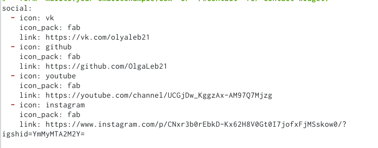
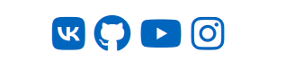
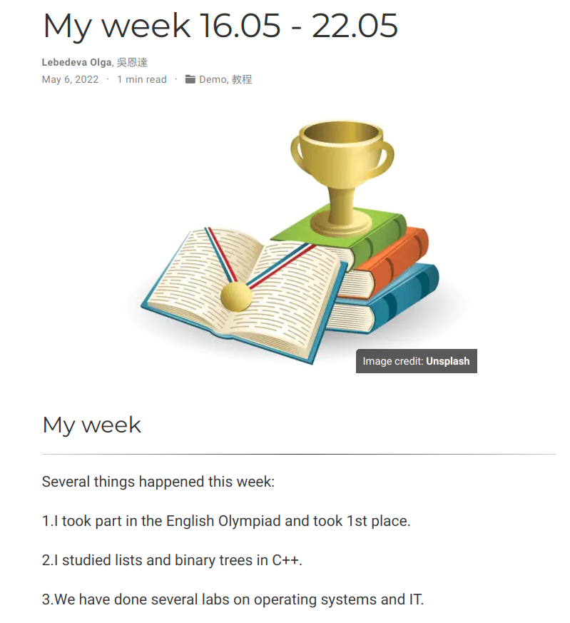
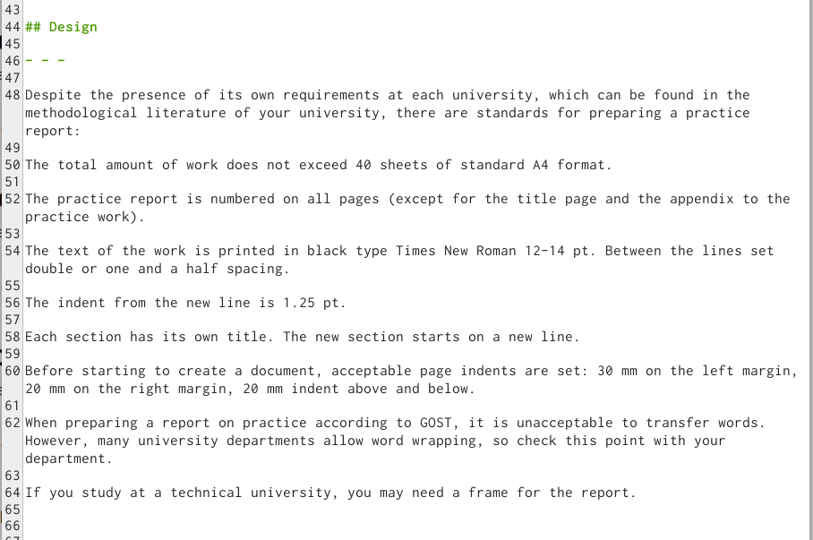
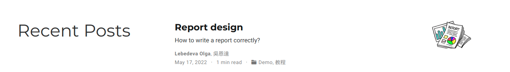
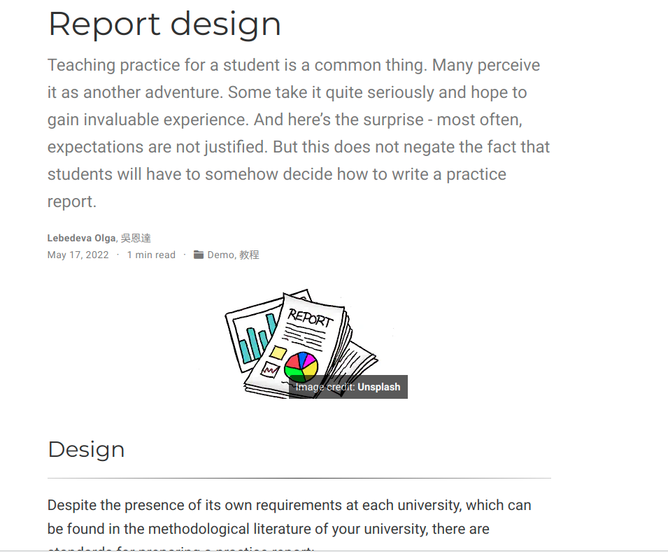

---
# Front matter
lang: ru-RU

## Formatting
toc: false
slide_level: 2
theme: metropolis
header-includes: 
 - \metroset{progressbar=frametitle,sectionpage=progressbar,numbering=fraction}
 - '\makeatletter'
 - '\beamer@ignorenonframefalse'
 - '\makeatother'
aspectratio: 43
section-titles: true
---

# Индивидуальный проект. Часть 4

## Цель работы

- Добавить к сайту ссылки.
- Сделать пост по прошедшей неделе.
- Добавить пост на тему по выбору:

1. Оформление отчёта.

2. Создание презентаций.

3. Работа с библиографией.

## Ход работы

1. Добавили к сайту ссылки на свои социальные сети, а также на Гитхаб. (рис. [-@fig:001]) (рис. [-@fig:002]) 

{ #fig:001 width=70% }

{ #fig:002 width=70% }

##

2. Написали пост по прошедшей неделе. (рис. [-@fig:003]) (рис. [-@fig:004]) 

{ #fig:003 width=70% }

{ #fig:004 width=70% }

##

3. Написали пост на тему по выбору : оформление отчета. (рис. [-@fig:005]) (рис. [-@fig:006]) (рис. [-@fig:007]) 

{ #fig:005 width=70% }

{ #fig:006 width=70% }

##

{ #fig:007 width=70% }

## Вывод

- Добавили к сайту ссылки.
- Сделали пост по прошедшей неделе.
- Добавили пост на тему по выбору:

1. Оформление отчёта.

