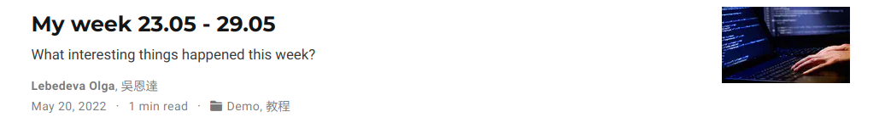
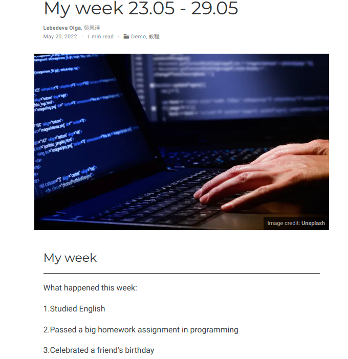
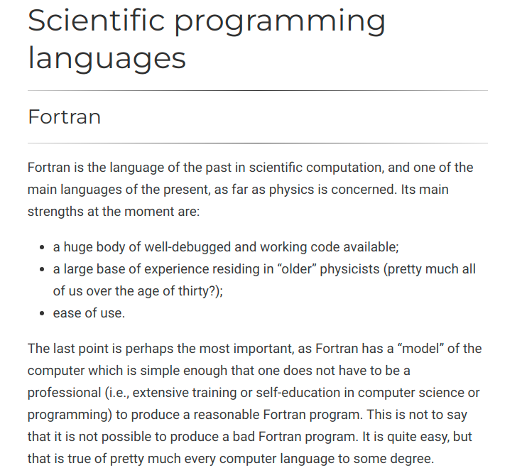
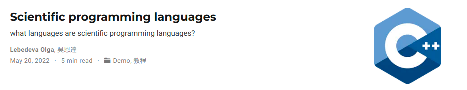
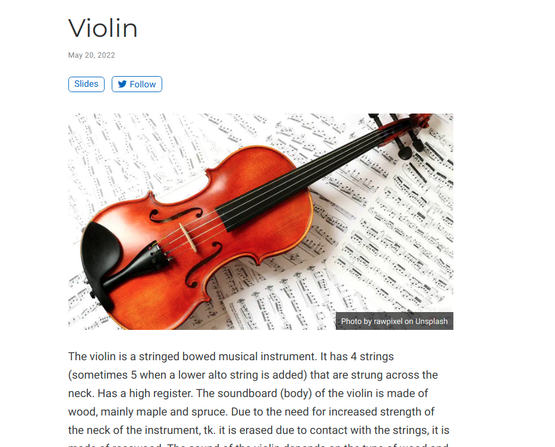
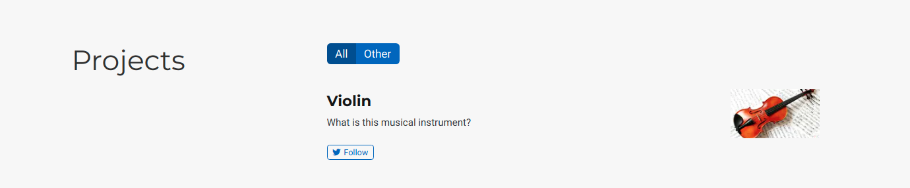

---
## Front matter
lang: ru-RU
title: Индивидуальный проект. Этап 5
author: |
	Лебедева Ольга Андреевна\inst{1}
	
institute: |
	\inst{1}RUDN University, Moscow, Russian Federation

## Formatting
toc: false
slide_level: 2
theme: metropolis
header-includes: 
 - \metroset{progressbar=frametitle,sectionpage=progressbar,numbering=fraction}
 - '\makeatletter'
 - '\beamer@ignorenonframefalse'
 - '\makeatother'
aspectratio: 43
section-titles: true
---

## Цель работы

- Сделать записи для персональных проектов.

- Сделать пост по прошедшей неделе.

- Добавить пост на тему по выбору: Языки научного программирования.

## Ход работы. Задание 1

1. Добавили пост по прошедшей неделе. (рис. [-@fig:001]) (рис. [-@fig:002]) 

{ #fig:001 width=70% }

{ #fig:002 width=35% }

## Задание 2

2. Добавили пост на тему по выбору. (рис. [-@fig:003]) (рис. [-@fig:004]) 

{ #fig:003 width=35% }

{ #fig:004 width=70% }

## Задание 3

3. Добавили проект. (рис. [-@fig:005]) (рис. [-@fig:006]) 

{ #fig:005 width=35% }

{ #fig:006 width=70% }

## Вывод

- Сделали записи для персональных проектов.

- Сделали пост по прошедшей неделе.

- Добавили пост на тему по выбору: Языки научного программирования.
