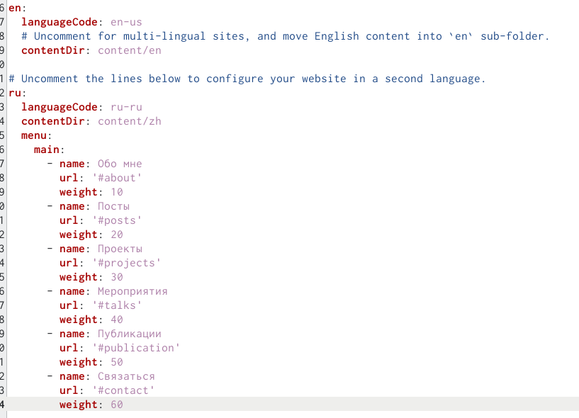
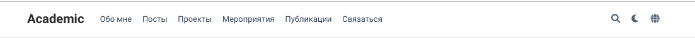
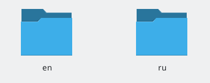
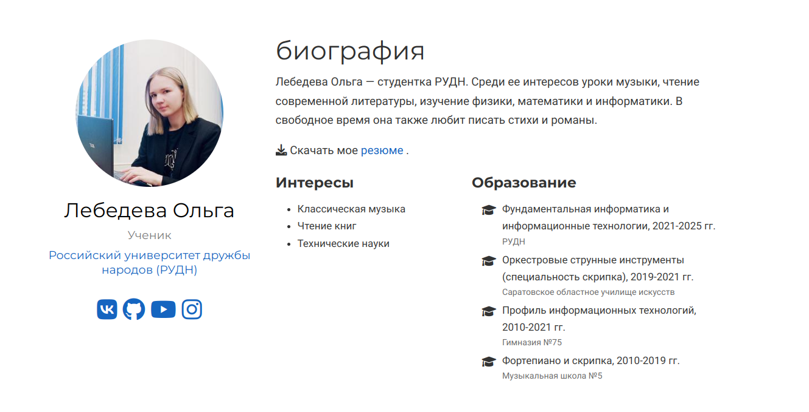
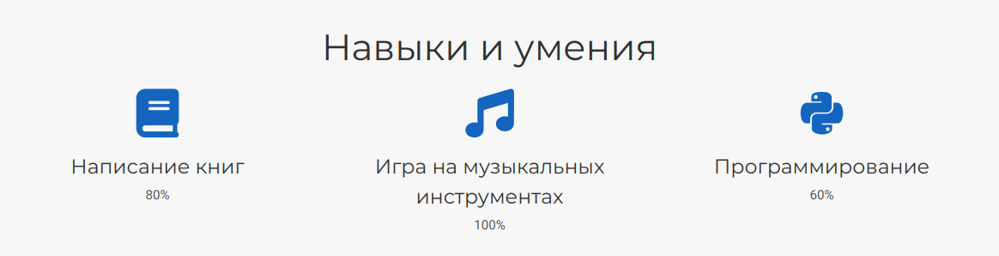
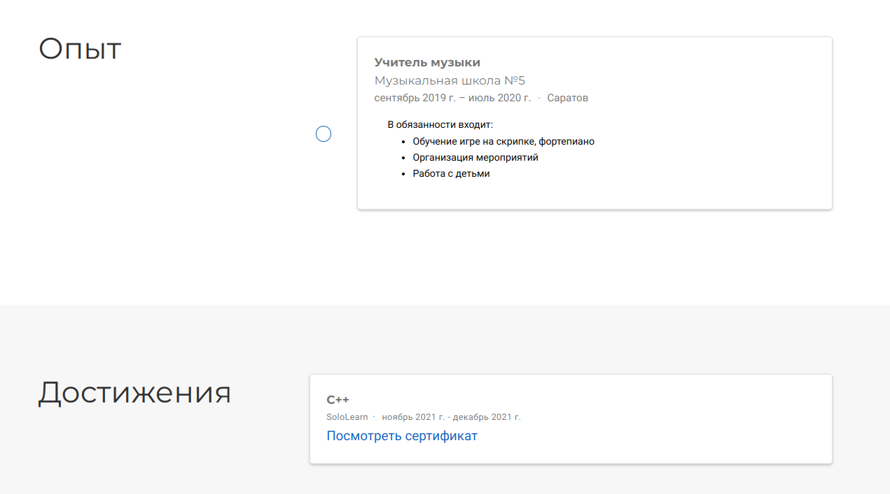
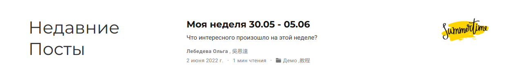
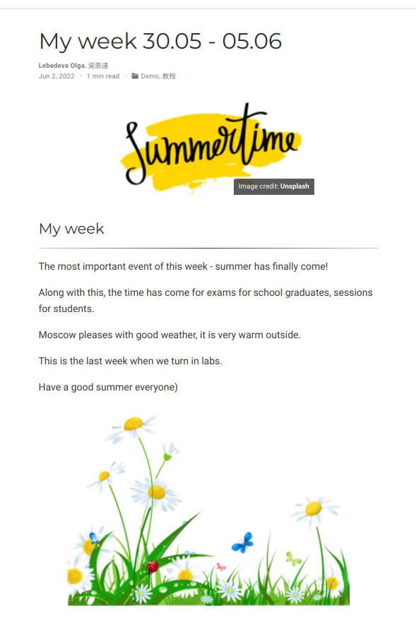
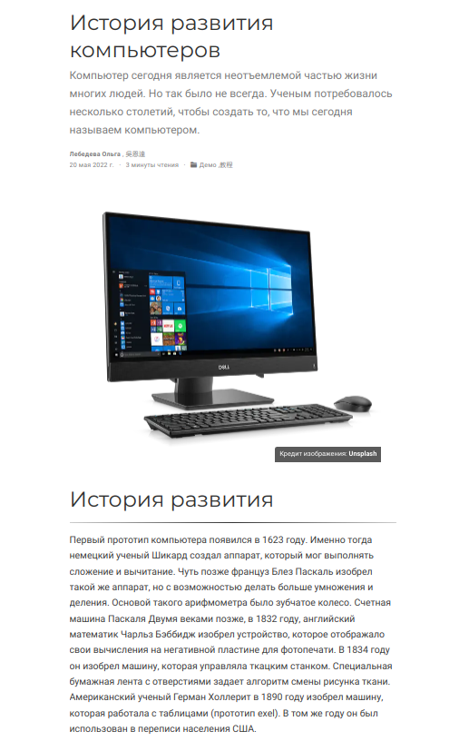

<<<<<<< HEAD
---
## Front matter
lang: ru-RU
title: Индивидуальный проект. Этап 6
author: |
	Лебедева Ольга Андреевна\inst{1}
	
institute: |
	\inst{1}RUDN University, Moscow, Russian Federation

## Formatting
toc: false
slide_level: 2
theme: metropolis
header-includes: 
 - \metroset{progressbar=frametitle,sectionpage=progressbar,numbering=fraction}
 - '\makeatletter'
 - '\beamer@ignorenonframefalse'
 - '\makeatother'
aspectratio: 43
section-titles: true
---

## Цель работы 

- Сделать поддержку английского и русского языков.

- Разместить элементы сайта на обоих языках.

- Разместить контент на обоих языках.

- Сделать пост по прошедшей неделе.

- Добавить пост на тему по выбору (на двух языках).

## Ход работы

Сделали поддержку двух языков - русского и английского. Изменили шапку в файле languages. (рис. [-@fig:001])

{ #fig:001 width=70% }

## Ход работы

Появился значок смены языка. (рис. [-@fig:002])

{ #fig:002 width=70% }

Все переведенные файлы поместили в отдельную папку ru. (рис. [-@fig:003])

{ #fig:003 width=70% }

## Ход работы

Получили переведенный сайт. (рис. [-@fig:004]) (рис. [-@fig:005]) (рис. [-@fig:006])

{ #fig:004 width=50% }

{ #fig:005 width=60% }

## Ход работы

{ #fig:006 width=70% }

## Ход работы

Также мы добавили пост по прошедшей неделе. (рис. [-@fig:007]) (рис. [-@fig:008])

{ #fig:007 width=70% }

{ #fig:008 width=30% }

## Ход работы

Загрузили пост на тему по выбору. Также с поддержкой двух языков. (рис. [-@fig:009]) (рис. [-@fig:010])

{ #fig:009 width=70% }

{ #fig:010 width=30% }

## Вывод

- Сделали поддержку английского и русского языков.

- Разместили элементы сайта на обоих языках.

- Разместили контент на обоих языках.

- Сделали пост по прошедшей неделе.

- Добавили пост на тему по выбору (на двух языках).
=======
---
## Front matter
lang: ru-RU
title: Индивидуальный проект. Этап 6
author: |
	Лебедева Ольга Андреевна\inst{1}
	
institute: |
	\inst{1}RUDN University, Moscow, Russian Federation

## Formatting
toc: false
slide_level: 2
theme: metropolis
header-includes: 
 - \metroset{progressbar=frametitle,sectionpage=progressbar,numbering=fraction}
 - '\makeatletter'
 - '\beamer@ignorenonframefalse'
 - '\makeatother'
aspectratio: 43
section-titles: true
---

## Цель работы 

- Сделать поддержку английского и русского языков.

- Разместить элементы сайта на обоих языках.

- Разместить контент на обоих языках.

- Сделать пост по прошедшей неделе.

- Добавить пост на тему по выбору (на двух языках).

## Ход работы

Сделали поддержку двух языков - русского и английского. Изменили шапку в файле languages. (рис. [-@fig:001])

{ #fig:001 width=70% }

## Ход работы

Появился значок смены языка. (рис. [-@fig:002])

{ #fig:002 width=70% }

Все переведенные файлы поместили в отдельную папку ru. (рис. [-@fig:003])

{ #fig:003 width=70% }

## Ход работы

Получили переведенный сайт. (рис. [-@fig:004]) (рис. [-@fig:005]) (рис. [-@fig:006])

{ #fig:004 width=70% }

{ #fig:005 width=70% }

## Ход работы

{ #fig:006 width=70% }

## Ход работы

Также мы добавили пост по прошедшей неделе. (рис. [-@fig:007]) (рис. [-@fig:008])

{ #fig:007 width=70% }

{ #fig:008 width=30% }

## Ход работы

Загрузили пост на тему по выбору. Также с поддержкой двух языков. (рис. [-@fig:009]) (рис. [-@fig:010])

{ #fig:009 width=70% }

{ #fig:010 width=30% }

## Вывод

- Сделали поддержку английского и русского языков.

- Разместили элементы сайта на обоих языках.

- Разместили контент на обоих языках.

- Сделали пост по прошедшей неделе.

- Добавили пост на тему по выбору (на двух языках).
>>>>>>> d9f718c591c23a41bbbcc2c4e3c679e5b60ca58a
